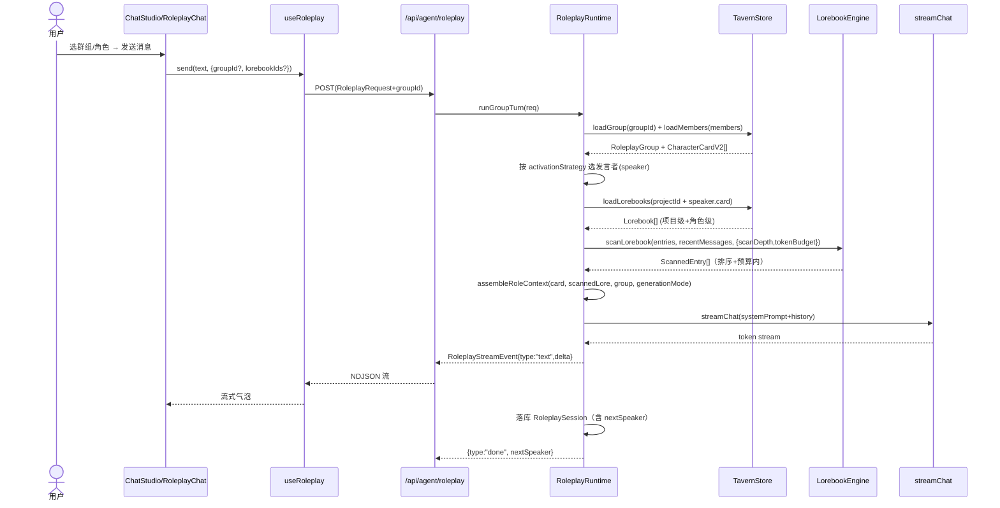

# 酒馆AI 模块 · SillyTavern 范式对齐增量设计

> **评审角色**：架构师（高见远 / Bob）
> **输入**：`novel-ui-landing-plan.md`（新主界面重构方案，原 T14「角色对话落点」被本设计取代）+ NovelChat UI 规范 §9 + SillyTavern 实读调研
> **硬约束（主理人齐活林）**：酒馆AI 模块必须参考 GitHub `SillyTavern/SillyTavern`，以「数据模型 + 扩展机制」为参考维度，**重点对齐 `character card V2` 与 `world info / lorebook` 数据规范**，保证兼容与可迁移。
> **范围**：增量架构设计 + 任务分解，**不写实现代码**。本设计为「新主界面重构方案」的附加卷，落点路径 `data/tavern/`，取代原 T14。
> **结论前置**：角色对话能力迁入「酒馆AI」页，并按 SillyTavern 范式（**角色卡 V2 + 世界书 + 群组**）重构，而非简单复用旧 `/api/agent/roleplay`。

---

## 1. SillyTavern 核心数据模型梳理（实读标注来源）

### 1.1 Character Card V2 字段全集

来源：[Character Card V2 Spec](https://github.com/malfoyslastname/character-card-spec-v2/blob/main/spec_v2.md)（社区规范，SillyTavern 采用）、[SillyTavern 仓库](https://github.com/SillyTavern/SillyTavern)。V1 为扁平 6 字段（name/description/personality/scenario/first_mes/mes_example）；V2 用 `spec:"chara_card_v2"` + `spec_version:"2.0"` 包一层 `data`，并新增下列字段。

| 字段 | 类型 | 是否进 prompt | 语义 |
|---|---|---|---|
| `spec` | `'chara_card_v2'` | 否 | 规范标识（MUST） |
| `spec_version` | `'2.0'` | 否 | 规范版本（MUST） |
| `data.name` | string | 是 | 角色名 |
| `data.description` | string | 是（默认） | 角色描述 |
| `data.personality` | string | 是 | 性格摘要 |
| `data.scenario` | string | 是 | 情境 / 背景 |
| `data.first_mes` | string | 是 | 第一条助手消息（开场白） |
| `data.mes_example` | string | 是 | `-separated` 示例对话 |
| `data.creator_notes` | string | **否** | 给用户的说明（推荐展示） |
| `data.system_prompt` | string | 是（覆盖全局 system） | 卡级系统提示；空→回退全局 |
| `data.post_history_instructions` | string | 是（置于历史后） | 历史后指令；空→回退全局 |
| `data.alternate_greetings` | string[] | 是 | 备选开场（swipe） |
| `data.character_book` | CharacterBook? | 是（嵌套 lorebook） | 角色专属世界书 |
| `data.tags` | string[] | 否 | 分类/筛选 |
| `data.creator` | string | 否 | 作者署名 |
| `data.character_version` | string | 否 | 版本号 |
| `data.extensions` | `Record<string,any>` | 否 | 应用自定义槽（**MUST 默认 `{}`，不得丢弃未知键**） |

> 关键规范语义：① `system_prompt`/`post_history_instructions` 默认**覆盖**用户全局设置（空串回退）；② `extensions` 为任意 JSON，**导入方不得销毁未知键**，建议按应用名命名空间（如 `novelchat/...`）；③ 角色卡可携带 `character_book`（嵌套 lorebook），导出时一并打包。

### 1.2 World Info / Lorebook 结构（CharacterBook V2）

来源：[SillyTavern World Info 文档](https://docs.sillytavern.app/usage/core-concepts/worldinfo/)。一个 lorebook = 一本「会自己翻页的词典」：每条 entry 有 `keys`（触发词）+ `content`（注入正文），按关键词命中动态注入 prompt。

**CharacterBook（lorebook 容器）**

| 字段 | 类型 | 语义 |
|---|---|---|
| `name` | string? | 世界书名（不进 prompt） |
| `description` | string? | 说明（不进 prompt） |
| `scan_depth` | number? | 从聊天末尾往前扫描多少条消息匹配关键词 |
| `token_budget` | number? | 世界书内容允许占用的 token 预算（超限后丢弃低 priority） |
| `recursive_scanning` | boolean? | entry 正文能否触发其它 entry（递归） |
| `extensions` | Record | 应用自定义 |
| `entries` | Entry[] | 条目数组 |

**LorebookEntry（单条）**

| 字段 | 类型 | 语义 |
|---|---|---|
| `keys` | string[] | 触发关键词（默认大小写不敏感；`/` 包裹按 JS 正则匹配） |
| `content` | string | 命中时注入 prompt 的文本 |
| `enabled` | boolean | 启用/禁用 |
| `insertion_order` | number | 数值越小越先插入（对输出影响越大） |
| `case_sensitive` | boolean? | 关键词是否区分大小写 |
| `name` | string? | 条目名（仅分类，不进 prompt） |
| `priority` | number? | token 预算超限时，值越小越先被丢弃 |
| `id` | number? | 仅分类 |
| `comment` | string? | 备注（不进 prompt） |
| `selective` | boolean? | 需 `keys` 与 `secondary_keys` 同时命中才触发 |
| `secondary_keys` | string[]? | 附加词（selective 时生效） |
| `constant` | boolean? | 预算允许时**始终**插入（无视关键词） |
| `position` | `'before_char' \| 'after_char'`? | 插入于角色定义前/后 |

> 注入策略（多来源叠加）：Chat Lore → Persona Lore → Character Lore / Global Lore，可 `Sorted Evenly`（按 insertion_order 混合）/ `Character First` / `Global First`。本设计采用 **默认 Sorted Evenly + 项目级 lorebook（Global）+ 角色级 lorebook（Character）** 两层叠加。

### 1.3 群组 / 预设 / 扩展机制简述

- **群组（Group Chat）**：来源 [Group Chats 文档](https://docs.sillytavern.app/usage/core-concepts/groupchats/)。核心对象 `Group{ id, name, members[], disabled_members[], activation_strategy, generation_mode, scenario_override?, greeting?, allow_self_responses }`。
  - **activation_strategy**（选下一位发言者）：`Manual`（用户指定）/ `List`（按 members 顺序轮转）/ `Natural`（按角色 talkativeness 概率激活）/ `Pooled`（随机选未发言者）。
  - **generation_mode**：`Swap`（仅注入当前发言者卡）/ `Append`（合并所有成员卡为联合提示）。
  - 群组历史**所有成员共享**；`scenario_override` 覆盖各成员自身 scenario；`group_only_greetings` 为群组专属开场（V3 字段，本设计用 `greeting` 等价承载）。
- **预设（Preset）**：SillyTavern 的「文本生成设置预设」——把 system prompt 模板、temperature、注入位置等打包复用。本设计以轻量 `Preset` 承载（系统提示模板 + 默认 scan_depth/token_budget）。
- **扩展机制（extensions）**：贯穿角色卡与 lorebook 的 `extensions` 任意键值槽，是本设计实现「**Novel&Chat 专属字段 ↔ SillyTavern 兼容**」的关键——我们用 `extensions.novelchat` 命名空间存放 `codexId/pinned/status/projectId/links` 等，既不破坏 V2 规范，又能双向迁移。

---

## 2. 本项目「人物」设定 → Character Card V2 字段映射

本项目人物数据现状：① `Project.codex`（CodexEntry，含 `id/name/aliases/summary/status/pinned/events`，`category==="人物"`）为程序化检索与角色对话的**唯一事实源**；② §9 设定类 `.md`（`人物设定_沈寄.md` 含 身份/年龄/性格/动机/弧光/关系）为**人类可编辑事实源**。现有 `lib/roleplay/persona.ts` 仅把 `summary` 当人设、`name/aliases/status/events` 当补充——**未分离 personality/scenario/first_mes 等 V2 维度**。

| V2 字段 | 现有覆盖 | 映射方案 | 落点 |
|---|---|---|---|
| `name` | ✅ CodexEntry.name | 直接映射 | codex |
| `description` | ⚠️ 部分（CodexEntry.summary 兼当描述+人设） | 优先取 `人物设定_*.md` 的「身份/简介」段；回退 summary | .md → 角色卡 |
| `personality` | ❌ 无独立字段 | 取 `.md` 的「性格」段；无则留空待补 | .md → 角色卡 |
| `scenario` | ❌ 无 | 取作品 `bible` 或群组 `scenario_override`；单卡可空 | bible / 群组 |
| `first_mes` | ❌ 无（现用固定欢迎语） | 新增：角色开场白，支持 `alternate_greetings` | 角色卡 |
| `mes_example` | ❌ 无 | 新增：示例对话（可选，作者填） | 角色卡 |
| `system_prompt` | ❌ 无 | 新增：卡级系统提示（覆盖全局；空→回退） | 角色卡 |
| `post_history_instructions` | ❌ 无 | 新增（可选） | 角色卡 |
| `alternate_greetings` | ❌ 无 | 新增：多开场 | 角色卡 |
| `creator_notes` | ❌ 无 | 映射为 `.md` 草稿备注 / 作者批注 | 角色卡 |
| `character_book` | ❌ 无 | 新增：角色绑定 lorebook（`tavernStore/lorebooks`，`extensions.novelchat.characterId`） | lorebook |
| `tags` | ⚠️ 间接（书详情 meta-tags） | 新增角色级 tags（可选） | 角色卡 |
| `creator` | ❌ 无 | 默认 `Novel&Chat` | 角色卡 |
| `character_version` | ❌ 无 | 新增递增版本（可选） | 角色卡 |
| `extensions.novelchat` | ❌ 无 | **新增**：`{ codexId, pinned, status, projectId, category }` 反向绑定 | 角色卡 |

**结论**：现有 `summary` 不足以表达 V2 全维度。决策为——**`Project.codex` 继续作检索/叙事事实源（不破坏现有 bible/retrieval），角色卡 V2 作为酒馆对话的「对话事实源」独立存于 `tavernStore`**，二者通过 `extensions.novelchat.codexId` 双向关联；`.md` 设定文件为角色卡 `description/personality/first_mes` 的可编辑上游（见 §3、§7）。

---

## 3. World Info / Lorebook 子系统设计

### 3.1 与 §9「设定 .md 共存」关系

- **`.md` 设定文件（世界观.md / 人物设定_*.md / 大纲.md）** = 人类可编辑事实源（§9 已定）。
- **lorebook（JSON，存 `tavernStore/lorebooks`）** = **运行时注入层**：承载 `.md` 无法表达的注入控制（keys / insertion_order / constant / selective / position / 预算）。
- **共存策略（推荐）**：每条 lorebook entry 的 `content` 可由对应 `.md` 正文生成（同步接缝 `syncDocsToTavern`），而 keys/order/budget 在 lorebook 编辑器内人工维护。即「**.md 写事实，lorebook 管注入**」。角色卡同理（`.md` 写人设，卡片写 V2 结构 + `first_mes` 等）。

### 3.2 数据模型（TypeScript 契约）

```typescript
// lib/tavern/types.ts —— 对齐 SillyTavern V2，扩展 novelchat 命名空间
export interface LorebookEntry {
  id: string;
  keys: string[];                 // 触发词；以 / 包裹视为 JS 正则
  content: string;                // 注入正文（可由 .md 同步）
  enabled: boolean;               // 默认 true
  insertion_order: number;         // 越小越先注入
  case_sensitive?: boolean;       // 默认 false
  name?: string;
  priority?: number;              // 预算超限时越小越先丢弃（默认 10）
  comment?: string;
  selective?: boolean;
  secondary_keys?: string[];
  constant?: boolean;             // 预算内恒插入
  position?: "before_char" | "after_char";
  extensions?: Record<string, any>;
  // —— novelchat 扩展 ——
  novelchat?: {
    sourceDoc?: string;           // 关联 .md 文件名（内容同步源）
    category?: string;            // 人物/地点/势力...
  };
}

export interface Lorebook {
  id: string;                     // 同文件名（safeId）
  name?: string;
  description?: string;
  scan_depth?: number;            // 默认 20（扫描最近 N 条消息）
  token_budget?: number;          // 默认 1024（近似 token）
  recursive_scanning?: boolean;   // 默认 false
  extensions?: Record<string, any>;
  entries: LorebookEntry[];
  novelchat: {
    ownerId: string;
    projectId?: string;           // 设值=项目级 world info（运行时自动加载）
    characterId?: string;         // 设值=角色级 lorebook
    kind: "project" | "character" | "standalone";
  };
}
```

### 3.3 扫描 / 注入机制（纯函数引擎 `lib/roleplay/lorebook.ts`）

```typescript
// 核心契约（不写实现，仅给契约）
export interface ScanOptions {
  scanDepth: number;        // 取最近 N 条消息作 haystack
  tokenBudget: number;      // 近似 token 上限
  recursive: boolean;       // 命中正文能否再触发其它 entry
}
export interface ScannedEntry { entry: LorebookEntry; matchedKey?: string; }
export function scanLorebook(
  entries: LorebookEntry[],
  recentMessages: { role: string; content: string }[],
  opts: ScanOptions
): ScannedEntry[];   // 返回已排序、预算内、待注入的条目

// 关键词匹配：/regex/ 走 RegExp，否则按逗号分隔的纯文本（默认大小写不敏感）
export function matchKey(haystack: string, key: string, caseSensitive: boolean): boolean;
// token 估算：默认字符启发式（中文≈1.6 字/token，英文≈4 字/token），可选 gpt-tokenizer
export function estimateTokens(text: string): number;
```

**注入流程（替换现有 `persona.ts` 的松散 `selectRelevantCodex`）**：
1. 取 `messages` 末 `scanDepth` 条拼为 haystack（格式 `name: content`，便于正则按角色匹配）。
2. `scanLorebook` 计算命中集：constant 恒入；普通 entry 需 key 命中（selective 时还需 secondary_keys 命中）；按 `insertion_order` 升序。
3. 预算裁剪：超 `token_budget` 时按 `priority` 升序丢弃，直至达标；constant 永不被裁。
4. recursive：若开启，已命中 entry 的 content 追加进 haystack 再扫一轮（最多 2 层，防环）。
5. 输出按 `position`（before_char / after_char）拼入 system prompt 的「世界书」段。

### 3.4 Token 预算策略

- 默认 `token_budget = 1024`、`scan_depth = 20`，可在 lorebook 编辑器与对话内模态调节。
- 估算用字符启发式（离线、零依赖）；若后续接 OpenAI 兼容模型且需精确，可选 `gpt-tokenizer`（见 §9）。
- 项目级 lorebook + 角色级 lorebook 叠加时，共享同一预算池（Sorted Evenly），角色级 priority 略高（优先保留）。

---

## 4. 群组 / 多角色轮转对齐

现有 `lib/roleplay/runtime.ts` 已支持 `participants[]` + `TurnMode(manual|round-robin|narrator-driven)` + `turnOrder/nextSpeakerIndex`——**已天然接近 SillyTavern 群组范式**。升级点：

| SillyTavern | 本项目现状 | 对齐方案 |
|---|---|---|
| `List`（按序轮转） | `round-robin` | **直接对齐**（保留） |
| `Manual` | `manual` | **直接对齐**（保留） |
| `Natural`（talkativeness 概率） | 无 | **新增** `natural` 策略：成员卡加 `extensions.novelchat.talkativeness`（0~1），按最近消息提及 + 概率选角 |
| `Pooled`（随机未发言者） | 无 | **新增** `pooled`（可选，MVP 可后置） |
| `generation_mode: Swap` | 现仅注入发言者卡 | **保留**（默认） |
| `generation_mode: Append` | 无 | **新增** `append`：合并所有成员卡为联合提示（带前缀/后缀分隔） |
| `scenario_override` | 无 | **新增**：群组 scenario 覆盖成员自身 |
| `greeting` / group_only_greetings | 无 | **新增**：群组开场白 |
| `disabled_members` / `allow_self_responses` | 无 | **新增**：静音成员 / 允许连续自回 |

**群组数据模型（存 `tavernStore/groups`）**：

```typescript
export interface RoleplayGroup {
  id: string;
  name: string;
  novelchat: { ownerId: string; projectId: string };
  members: string[];              // codexId 数组（顺序即 List 轮转序）
  disabledMembers: string[];      // 静音
  activationStrategy: "manual" | "list" | "natural" | "pooled";
  generationMode: "swap" | "append";
  scenarioOverride?: string;
  greeting?: string;              // 群组专属开场
  allowSelfResponses: boolean;
}
```

运行时：无 `groupId` → 走现有 1v1/多角色路径（向后兼容）；有 `groupId` → 加载 Group，按 `activationStrategy` 选发言者，按 `generationMode` 决定注入单卡或合并卡，历史全成员共享（沿用 `RoleplaySession`）。

---

## 5. 与现有 Agent 运行时衔接（契约扩展点）

> 仅给**接口契约与扩展点**，不写实现。

### 5.1 `lib/roleplay/types.ts` 扩展

```typescript
// RoleplayRequest 增加（向后兼容：全可选）
export interface RoleplayRequest {
  // ... 原有字段 ...
  groupId?: string;               // 走群组范式
  lorebookIds?: string[];         // 显式指定额外 lorebook（否则自动加载 项目级+角色级）
  scanDepth?: number;
  tokenBudget?: number;
  activationStrategy?: RoleplayGroup["activationStrategy"]; // manual 时前端指定
  generationMode?: RoleplayGroup["generationMode"];
  scenarioOverride?: string;
}
// RoleplayStreamEvent 不变（text/done/error），保证旧客户端兼容
```

### 5.2 `lib/roleplay/persona.ts` 重构为 `assembleRoleContext`

```typescript
export interface RoleContext {
  systemPrompt: string;
  injectedLore: ScannedEntry[];        // 调试/UI 展示
  speakerCard?: CharacterCardV2;       // 当前发言者卡（append 时为合并卡）
}
export function assembleRoleContext(
  project: Project,
  speaker: RoleplayCharacterCard,
  messages: RoleplayMessage[],
  opts: {
    card: CharacterCardV2;             // 由 tavernStore 加载（回退 codex→card）
    lorebooks: Lorebook[];             // 项目级 + 角色级 + 显式
    group?: RoleplayGroup;             // 群组模式
    otherMembers?: RoleplayCharacterCard[];
  }
): RoleContext;
```

### 5.3 `lib/roleplay/characterCard.ts`（新增，纯函数）

- `codexEntryToCard(entry: CodexEntry): CharacterCardV2` —— CodexEntry → 最小 V2 卡（向后兼容回退）。
- `loadCharacterCard(tavernStore, codexId): Promise<CharacterCardV2>` —— 优先读 `tavernStore/characters/<codexId>.json`，缺失则回退 `codexEntryToCard`。
- `cardToPersonaBlock(card): string` —— 把 V2 字段拼为人设段（name/description/personality/scenario/first_mes/mes_example/system_prompt）。

### 5.4 `lib/roleplay/lorebook.ts`（新增，纯函数，见 §3.3）

### 5.5 `app/api/agent/roleplay/route.ts` 扩展

- 请求体增加 §5.1 字段；`groupId` 存在时调用 `runGroupTurn`（复用 `runMultiRoleplayTurn` 骨架，换选角逻辑 + 合并卡）。
- 响应契约不变；新增可选 `/api/tavern/{characters|lorebooks|groups|presets}` CRUD 路由供 UI 读写 `tavernStore`（契约：`list/read/save/remove` 同 `docsStore`）。

### 5.6 `useRoleplay`（客户端状态机）扩展

- 选项增加 `groupId?`、`lorebookIds?`、`scanDepth?`、`tokenBudget?`、`activationStrategy?`、`generationMode?`，透传至请求体。
- 群组模式下暴露 `members`、`disabledMembers`、`setStrategy`，供 `#page-tavern` 群组选择器使用。

---

## 6. 酒馆详情页 `#page-tavern` 改造

现状（§9 + 原型 `#page-tavern`）：右栏独立 `detail-page`，三分段 `[成果|阅读|文档]`，常态收起、点左栏「酒馆AI」展开。**改造原则：保留三分段外壳，在「成果」页内增「酒馆配置台」入口，打开 SillyTavern 子模块管理器**（不破坏 §9 的互斥/独立约束）。

### 6.1 子模块布局（在「成果」pane 内）

| 子模块 | 载体组件 | 功能 |
|---|---|---|
| 角色卡库 | `TavernCharacterManager` | 列出本书 `codex` 中「人物」；点开 V2 编辑器（name/description/personality/scenario/first_mes/alternate_greetings/system_prompt + 绑定 lorebook）；支持**导入/导出 SillyTavern V2 JSON**（兼容性验证点） |
| 世界书编辑器 | `TavernLorebookEditor` | 项目级 lorebook：条目表格（keys/content/insertion_order/constant/selective/position）、全局 scan_depth/token_budget、绑定到 project/character；`.md` 同步按钮 |
| 群组配置 | `TavernGroupManager` | 建群组、增删/排序成员、设 activationStrategy/generationMode/scenarioOverride/greeting、静音成员 |
| 预设管理 | `TavernPresetManager` | 轻量：system 提示模板 + 默认 scan_depth/token_budget（可选，MVP 可极简） |

交互：点「酒馆配置台」→ 「成果」pane 替换为子模块网格（带「返回」chevron 回成果）；各子模块编辑后写入 `tavernStore`。角色对话入口（现原型 `seedTavernChat`）改为先选「角色卡 / 群组」再进入，中栏 `RoleplayChat` 复用（重构以支持卡片/lorebook/群组 props）。

### 6.2 融入关系图

```
#page-tavern
 ├─ 成果 pane
 │   ├─ 在酒馆里聊聊 / 进入（选角色或群组 → 中栏 RoleplayChat）
 │   ├─ 今日灵感 / 灵感碎片 / 核心设定（沿用原型）
 │   └─ 【酒馆配置台】→ 角色卡库 | 世界书 | 群组 | 预设  （SillyTavern 范式新增）
 ├─ 阅读 pane（方格稿纸，沿用）
 └─ 文档 pane（docsStoreTv 灵感 .md，沿用；可扩展显示角色卡/lorebook 导出）
```

---

## 7. 存储落点

新增 **`tavernStore`**（类比 `docsStore`/`storage.ts`），单一数据根 `dataRoot()/tavern/`，遵循 `storage.ts` 的 `safeId` 防穿越与 `ownerId` 字段过滤约定。

| 制品 | 路径 | 格式 | 与 §9 共存关系 |
|---|---|---|---|
| 角色卡 | `data/tavern/characters/<codexId>.json` | SillyTavern V2（含 `extensions.novelchat.codexId`） | 与 `Project.codex` 通过 codexId 双向关联；`.md 人物设定` 为其可编辑上游 |
| 世界书 | `data/tavern/lorebooks/<id>.json` | CharacterBook V2 | `extensions.novelchat.projectId` 标项目级；`.md 世界观/设定` 为 entry.content 上游 |
| 群组 | `data/tavern/groups/<id>.json` | RoleplayGroup | 独立，绑定 projectId |
| 预设 | `data/tavern/presets/<id>.json` | Preset | 独立 |
| 角色对话会话 | `data/roleplay/<id>.json` | RoleplaySession（已有） | 不变 |

**关键共存说明**：原 `Project.codex` / `bible` / 设定 `.md` **全部保留**，不做硬迁移。lorebook/角色卡是**叠加的运行时注入层**；`syncDocsToTavern()` 把 `.md` 正文回填进 lorebook entry / 角色卡字段（单向同步，人工在 tavernStore 维护 keys/order）。这样既有 SillyTavern 兼容性与可迁移，又不破坏现有 bible/检索/百万字记忆体系。

---

## 8. 增量任务分解（TT-*）

> 取代原 **T14**（原「角色对话 + 旧工作台专家模式落点」，2d，可延后）。编号独立，标注对原 T01–T15 的依赖与插入点。总预估 **≈ 23.5 人天**（净增量，取代 T14 后相对原 36d 计划约 +21.5d）。

| 编号 | 标题 | 归属文件（新建/改造） | 依赖前置 | 工作量 | 属性 |
|---|---|---|---|---|---|
| **TT-01** | tavernStore 存储层（characters/lorebooks/groups/presets 的 list/read/save/remove + 目录约定） | `lib/tavern/store.ts`、`lib/tavern/types.ts` | 无（与 T07 并行） | 2.5d | 地基必做 |
| **TT-02** | 角色卡数据模型 + CodexEntry↔V2 映射 + 加载/回退 | `lib/roleplay/characterCard.ts`、`lib/tavern/types.ts` | T07, TT-01 | 2d | 必做 |
| **TT-03** | lorebook 数据模型 + 扫描/注入引擎（regex 匹配、budget、order、recursive） | `lib/roleplay/lorebook.ts` + 单测 | TT-01 | 3d | 必做（核心） |
| **TT-04** | 群组数据模型 + 轮转策略对齐（natural/pooled 可选）+ 运行时选角 | `lib/roleplay/runtime.ts`（扩展 `runGroupTurn`）、`lib/tavern/types.ts` | TT-01, 现有 runtime | 2.5d | 必做 |
| **TT-05** | persona 层重构：接入角色卡 + lorebook 注入 + 群组卡合并(SWAP/APPEND) | `lib/roleplay/persona.ts` → `assembleRoleContext` | TT-02, TT-03, TT-04 | 3d | 必做 |
| **TT-06** | `/api/agent/roleplay` 接口扩展（groupId/lorebookIds/scanDepth/tokenBudget/策略）+ 路由 + tavern CRUD 路由 | `app/api/agent/roleplay/route.ts`、`app/api/tavern/*/route.ts` | TT-05 | 1.5d | 必做 |
| **TT-07** | `useRoleplay` 扩展（群组/lorebook 配置）+ `RoleplayChat` 重构迁入 `#page-tavern`（**取代 T14**） | `lib/roleplay/useRoleplay.ts`、`components/RoleplayChat.tsx`、接入 `TavernDetail` | TT-06, T08 | 3d | 必做 |
| **TT-08** | `#page-tavern` SillyTavern 子模块 UI（角色卡库/世界书/群组/预设管理器） | `components/studio/tavern/*`（4 个管理器 + 配置台入口） | T08, TT-01..TT-04 | 4d | 必做 |
| **TT-09** | `.md ↔ 角色卡/lorebook` 同步接缝（syncDocsToTavern）+ 旧数据迁移 | `lib/tavern/sync.ts`（接入 `lib/migrate.ts`） | T10, TT-02, TT-03 | 2d | 必做（共存） |

**可并行组**：`TT-01 ∥ T07`（docsStore，无耦合）；`TT-02`/`TT-03`/`TT-04` 在 `TT-01` 后均可并行启动。
**必须串行链**：`TT-01 → TT-02 → TT-05 → TT-06 → TT-07`；`TT-01 → TT-03 → TT-05`；`TT-01 → TT-04 → TT-05`；`TT-08` 汇入 `T08`（RightDock/TavernDetail）。
**取代关系**：TT-07 完全取代原 T14（角色对话落点），原 T14 的 2d 从主计划移除。

---

## 9. 依赖包列表

| 包 | 用途 | 是否新增 | 说明 |
|---|---|---|---|
| `next@15` / `react@19` / `tailwindcss@4` / `typescript` | 既有技术栈 | 已有 | 不换 |
| `zod` | 角色卡 V2 / lorebook 导入校验（命名空间安全） | ✅ 推荐新增（极小） | 防止非法 V2 JSON 破坏 `extensions` 未知键；可选 |
| `gpt-tokenizer` | 精确 token 预算（OpenAI 兼容模型） | ⚪ 可选 | MVP 用字符启发式（零依赖）即可，精确预算按需引入 |
| 正则关键词扫描 | 原生 `RegExp`（SillyTavern 风格 `/regex/` 分隔） | 已有（JS 内置） | 无需第三方库 |
| `react-markdown` + `remark-gfm` | `.md` 设定/角色卡内容渲染（原 T06 已定） | 已有（原方案） | 复用 |
| `vitest` + `@testing-library/react` | `lib/roleplay/lorebook.ts` / `characterCard.ts` 契约单测 | 已有 | 覆盖扫描/匹配/回退 |

> 结论：**无需引入专用 character-card 解析库或 lorebook 匹配库**——V2 结构为简单 JSON，自研 `characterCard.ts` + `lorebook.ts` 更可控、离线优先、零额外体积；仅 `zod`（可选）用于导入校验。

---

## 10. 待明确事项（新待确认项，已较原方案收敛）

1. **角色卡与 codex 的「单一事实源」边界**：本设计取「codex 作叙事/检索源、角色卡 V2 作对话源、`.md` 作编辑上游」三方共存。是否同意此三方共存，还是要求角色卡字段**回写**进 `Project.codex`（如新增 `personality`/`firstMes` 字段）以彻底统一？→ 建议共存（成本最低），待主理人拍板。
2. **`natural` 轮转策略（talkativeness）是否进 MVP**：SillyTavern 的 Natural 需每个角色加 talkativeness 值，产品成本较高。建议 MVP 仅 `list(round-robin)` + `manual`，`natural/pooled` 后置。是否同意？
3. **lorebook 自动加载范围**：默认自动加载「项目级 lorebook + 当前角色绑定 lorebook」。是否还需要「全局默认 lorebook」（跨书共享常识）？建议首版不引入全局层，避免注入膨胀。
4. **`.md ↔ 角色卡/lorebook` 同步方向**：本设计取「`.md` 写事实 → 同步入卡片/lorebook（单向）」。是否需双向（在 tavernStore 改了 content 也能回写 `.md`）？建议单向（`.md` 为唯一可编辑源），降低同步复杂度。
5. **角色卡导入/导出格式**：是否要求完整支持 SillyTavern PNG 嵌入式角色卡（tEXt/iTXt `chara` chunk）导入？建议 MVP 仅支持 **V2 JSON 导入/导出**（PNG 嵌入后置），以控制工作量。

> 以上 5 项均可在 TT-02/TT-03 开工前由主理人一次性拍板；相较原方案 8 项待确认，本轮已收敛。

---

## 附：类图（Mermaid）

```mermaid
classDiagram
    class CharacterCardV2 {
      +spec: "chara_card_v2"
      +spec_version: "2.0"
      +data: CardData
      +extensions.novelchat: {codexId, pinned, status, projectId}
    }
    class CardData {
      +name: string
      +description: string
      +personality: string
      +scenario: string
      +first_mes: string
      +mes_example: string
      +system_prompt: string
      +alternate_greetings: string[]
      +character_book?: Lorebook
      +tags: string[]
      +creator: string
    }
    class Lorebook {
      +id: string
      +name: string
      +scan_depth: number
      +token_budget: number
      +recursive_scanning: boolean
      +entries: LorebookEntry[]
      +novelchat: {projectId?, characterId?, kind}
    }
    class LorebookEntry {
      +id: string
      +keys: string[]
      +content: string
      +enabled: boolean
      +insertion_order: number
      +constant: boolean
      +selective: boolean
      +secondary_keys: string[]
      +position: before_char|after_char
      +novelchat.sourceDoc?: string
    }
    class RoleplayGroup {
      +id: string
      +name: string
      +members: string[]
      +disabledMembers: string[]
      +activationStrategy: manual|list|natural|pooled
      +generationMode: swap|append
      +scenarioOverride?: string
      +greeting?: string
    }
    class TavernStore {
      +listCharacters(ownerId): CardMeta[]
      +readCharacter(codexId): CharacterCardV2
      +saveCharacter(card): void
      +listLorebooks(ownerId, projectId): Lorebook[]
      +saveLorebook(book): void
      +listGroups(ownerId, projectId): RoleplayGroup[]
      +saveGroup(g): void
    }
    class RoleplayRuntime {
      +runRoleplayTurn(req)
      +runGroupTurn(req)
      +assembleRoleContext(project, speaker, msgs, opts)
    }
    class LorebookEngine {
      +scanLorebook(entries, msgs, opts): ScannedEntry[]
      +matchKey(haystack, key, cs): boolean
    }
    class CodexEntry {
      +id: string
      +name: string
      +category: "人物"
      +summary: string
      +status: string
      +pinned: boolean
    }

    CharacterCardV2 *-- CardData
    CharacterCardV2 ..> Lorebook : character_book
    Lorebook *-- LorebookEntry
    RoleplayRuntime ..> LorebookEngine : scan
    RoleplayRuntime ..> TavernStore : load card/lorebook/group
    RoleplayRuntime ..> CodexEntry : fallback(codexId)
    TavernStore ..> CharacterCardV2
    TavernStore ..> Lorebook
    TavernStore ..> RoleplayGroup
```

## 附：程序调用流程（Mermaid · 群组 + lorebook 注入一轮）


