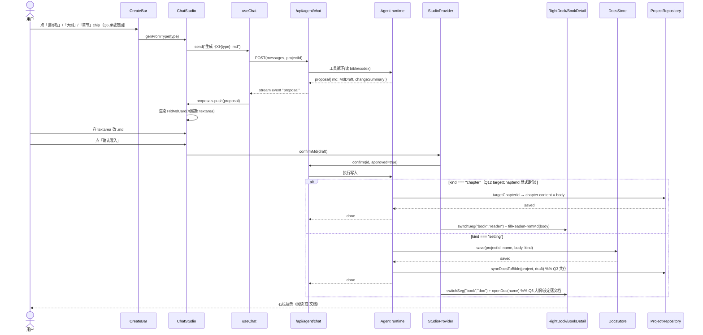
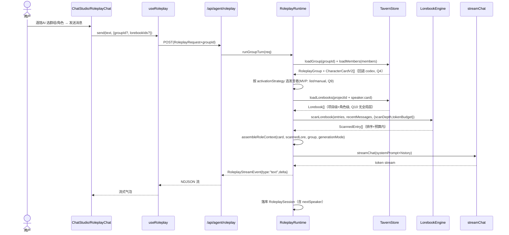
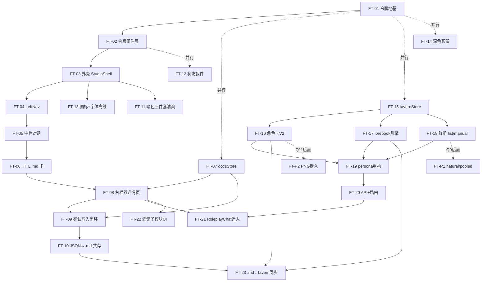

# Novel&Chat 新主界面 · 落地方案（合并终稿）

> **版本**：v1.0 终稿（合并定稿）
> **日期**：2026-07-25（合并定稿，依据两份前置方案 + 用户 12 项决策）
> **角色**：架构师 高见远（Gao）
> **范围**：架构设计 + 任务分解，**不写实现代码**
> **依据**：
> - `NovelChat_UI_REDESIGN_SPEC.md` §9（v5.2 终态，权威规范）
> - `NovelChat_main_prototype.html`（v5.2 可交互原型，清爽风令牌与新三栏实现）
> - `novel-ui-landing-plan.md`（主界面重构方案 T01–T15 ≈ 36 人天）
> - `novel-tavern-design.md`（酒馆AI SillyTavern 范式对齐增量设计 TT-01~TT-09 ≈ 23.5 人天，取代原 T14）
> - 配套图：`class-diagram.mermaid` / `sequence-diagram.mermaid` / `tavern-class-diagram.mermaid` / `tavern-sequence-diagram.mermaid`

---

## 0. 用户已拍板 12 项决策总表

| # | 议题 | 决策 | 终稿落点 |
|---|------|------|---------|
| Q1 | 暗色三件套（TaskQueue/HistoryPanel/ExportDialog）方向 | **统一清爽风**（消除壳清爽/弹层暖阁割裂） | FT-11 |
| Q2 | 字体打包 | **离线打包进 Electron** | FT-13（electron 资源） |
| Q3 | JSON→.md 迁移 | **共存 + .md 为主**（bible JSON 兜底不硬删） | FT-07 / FT-10 |
| Q4 | codex↔角色卡 V2 边界 | **三方共存**（不回写 codex） | FT-16 |
| Q5 | .md 同步方向 | **单向**（.md 为唯一可编辑源 → 同步入卡片/lorebook） | FT-10 / FT-23 |
| **Q6** | **旧工作台（Workspace/StepOutline/StepWriting）命运** | **⚠️ 融入对话**（拆掉独立工作台路由页，大纲/正文/角色对话能力全部并入中栏对话系统） | FT-03 / FT-05 / FT-06 / 废弃列 |
| Q7 | 辅助独立页（/new /continue /style /shelf /settings /agent）去留 | **保留深链**（主路径走对话内模态） | FT-03 |
| Q8 | md 渲染器选型 | **react-markdown + remark-gfm** | FT-08（DocReader） |
| Q9 | natural 轮转进 MVP | **后置**（MVP 仅 list+manual） | FT-18 / FT-P1 |
| Q10 | 全局默认 lorebook | **首版不引入** | （本期不立项） |
| Q11 | PNG 嵌入式角色卡 | **MVP 仅 V2 JSON**（PNG 后置） | FT-16 / FT-P2 |
| Q12 | 章节 targetChapterId | **Agent 显式产出**（提案卡带 chapterId） | FT-06（MdDraft.targetChapterId） |

---

## 1. 实现方案总览

### 1.1 外壳（StudioShell 改造）

- `AppShell.tsx` 重写为 `StudioShell`：`topbar 52px` + 横向三栏（`left 248/56` + `center flex:1` + `right 380/0`）。左/右收起语义：收起后中栏 `flex:1` 自动吃满（修旧版留白）。
- 新主界面作为应用根 `/`：`app/page.tsx` 挂载 `StudioProvider` + `StudioShell`，中栏渲染 `ChatStudio`。
- **Q6 改写**：不再有独立的 `/project/[id]` 工作台路由页。`/project/[id]` 仅作**深链兼容** → 重定向 `/?book=<id>` 由 Studio 打开该书详情。**Workspace / StepOutline / StepWriting 组件废弃**，其能力（大纲 two-step、正文 writing、角色对话）全部收进中栏对话系统（详见 §1.3）。
- 工作区结构更纯粹：**左=纯导航 / 中=纯对话 / 右=可收起展示**。
- 辅助路由（`/new /continue /style /shelf /settings /agent`）保留为可达深链（Q7），主路径改为对话内触达：`新/续写/拆书工坊` 经中栏「+」`seedChat` 进对话；`接口设置/技能` 经对话内模态 `InDialogModal`。

### 1.2 令牌迁移（清爽风层 + 暖阁降级映射）

- `app/globals.css` 的 `:root` 采用**双层共存**：
  1. **清爽风主层（新主界面权威）**：取值来自原型 `:root` / §9.1——`--bg #f6f7f9` / `--surface #fff` / `--surface-2 #f1f3f5` / `--surface-3 #e9edf0` / `--border rgba(27,31,36,.10)` / `--border-strong rgba(27,31,36,.16)` / `--fg #1f2328` / `--fg-dim #656d76` / `--fg-faint #8b949e` / `--accent #d97757` / `--accent-strong #b85c3c` / `--accent-soft rgba(217,119,87,.12)` / `--jade #3f9d6b` / `--amber #d9a23c` / `--danger #e5484d` / `--paper #fbfaf6` / `--paper-line rgba(27,31,36,.06)` / 圆角 `--radius 10px`/`--radius-sm 8px`/`--radius-pill 999px` / 阴影 `--shadow-sm`/`--shadow-md`。
  2. **暖阁降级层（仅继承面）**：保留 `--cinnabar*`/`--ink*`/`--jade(旧)` 等用于**方格稿纸底色 `--paper`（暖白）、汉字印章 `.seal`**、以及（Q1 前）暗色三件套救火目标——**Q1 后暗色三件套统一清爽风，暖阁降级层不再承接弹层救火**。
- 缺口清理（FT-02）：新增 `--space-1..16` 间距阶梯、`--shadow-float`、层级 `--z-*`；正式定义 `--accent`；清除 `--ink-900`/`--accent` 未定义引用（`AgentPanel.tsx` 已随废弃消失）；全站检索替换硬编码色与 Tailwind 暗色类。
- **Q2 字体离线**：`--font-ui` 用系统字体 + PingFang SC/雅黑；`--font-serif` = Noto Serif SC（方格稿纸）。需将 **Noto Serif SC 与线性图标（lucide-react / 印章 SVG）打包进 Electron**（`electron/main.js` 资源目录 + 正确 `font-face` `src` 指向 `app://` 本地路径），确保离线可用（FT-13）。

### 1.3 中栏对话系统（Q6 融入对话后的承载范围）

**Q6 核心改写**：原 T06（中栏对话）与 T14（角色对话落点）假设"旧工作台可能保留为专家模式"。现 Q6 拍板**融入对话**，中栏对话系统须承接更多能力：

| 能力 | 原落点 | Q6 后落点 |
|------|--------|-----------|
| 快速创作（世界观/人物/大纲/章节） | 中栏 create-bar | **不变**（中栏 create-bar 四 chip） |
| 大纲编辑（two-step） | StepOutline（独立工作台） | **并入对话**：对话内可编辑 `.md` 提案卡（大纲.md）→ 右栏 `#page-book`「成果/文档」呈现；或对话内模态编辑 |
| 正文 writing | StepWriting（独立工作台，含方格稿纸） | **并入对话**：章节类 `.md` 提案卡「确认写入」→ 右栏 `#page-book`「阅读」方格稿纸落稿（FT-09） |
| 角色对话 | RoleplayChat（独立页 / 旧 T14） | **迁入「酒馆AI」页**：选角色/群组 → 中栏 `RoleplayChat` 复用（重构支持卡片/lorebook/群组，FT-21） |

> 结论：中栏 = 纯 AI 对话系统（create-bar + 消息流 + HITL .md 提案卡 + composer + plus 展开器 + 对话内模态 + RoleplayChat 模式）。**不再有独立工作台组件依赖**——原 T06 之前依赖的"工作台组件"不再存在，中栏直接建立在 `useChat` + `HitlMdCard` + 右栏落稿之上。

### 1.4 右栏双详情页（`#page-book` / `#page-tavern`，Q6 下大纲/正文如何落 `#page-book`）

- `RightDock` 内部渲染两个**完全独立**的 `detail-page`，靠 `rightMode` 切换 CSS class 互斥显示（对齐 §9.5）。
- `#page-book`（点左栏某书触发）：`BookDetail` = 表头（书名 + 三分段 `[成果|阅读|文档]` + 收起 chevron）+ 内容区：
  - **成果**：logline / 梗概 / 章节列表(状态点) / 核心设定(meta-tags)（来自 `Project`）。
  - **阅读**：方格稿纸 `Reader`（卷·章头 + 衬线正文）；**Q6 后正文由对话内章节 `.md` 提案卡「确认写入」落稿**（`fillReaderFromMd`）。
  - **文档**：`.md` 列表 `DocList` + Markdown 渲染 `DocReader`。**Q6 后大纲 `.md`（`大纲_卷一.md`）、人物设定 `.md`、世界观 `.md` 均在此呈现**——即原工作台"大纲/设定"产出统一经 `.md` 文档落 `#page-book`，不再有独立大纲编辑器。
- `#page-tavern`（点左栏「酒馆AI」触发）：`TavernDetail` = 同类三分段 + 「酒馆配置台」入口（`TavernCharacterManager` / `TavernLorebookEditor` / `TavernGroupManager` / `TavernPresetManager`），以及"在酒馆里聊聊"选角色/群组进入中栏 `RoleplayChat`。

### 1.5 酒馆AI（SillyTavern 范式：角色卡 V2 / 世界书 / 群组，取代 T14）

- **取代原 T14**：角色对话能力迁入「酒馆AI」页，按 SillyTavern 范式重构（**角色卡 V2 + 世界书 lorebook + 群组**），而非简单复用旧 `/api/agent/roleplay`。
- 数据模型对齐 `Character Card V2` Spec + SillyTavern `World Info / Lorebook` + `Group Chats`：
  - **角色卡 V2**：`spec:"chara_card_v2"` + `spec_version:"2.0"` 包 `data`（name/description/personality/scenario/first_mes/mes_example/system_prompt/alternate_greetings/character_book/tags/creator/...）+ `extensions.novelchat`（codexId/pinned/status/projectId）。
  - **世界书 Lorebook**：`CharacterBook` 容器（scan_depth/token_budget/recursive_scanning/entries）+ `LorebookEntry`（keys/content/enabled/insertion_order/constant/selective/position/...）。
  - **群组 Group**：`RoleplayGroup`（members/disabledMembers/activationStrategy/manual|list|natural|pooled/generationMode/swap|append/scenarioOverride/greeting/allowSelfResponses）。
- **共存策略（Q3/Q4/Q5）**：`Project.codex`/`bible` 作检索/叙事事实源；角色卡 V2 作酒馆对话事实源（存 `tavernStore`）；两者经 `extensions.novelchat.codexId` 关联、**不回写 codex**（Q4）；`.md` 设定文件为角色卡字段可编辑上游；`.md ↔ 卡片/lorebook` **单向同步**（Q5）。
- **Q9/Q10/Q11 边界**：MVP 轮转仅 `list(round-robin)+manual`（`natural/pooled` 后置）；首版不引入全局默认 lorebook（Q10）；MVP 仅 V2 JSON 导入导出（PNG 嵌入后置，Q11）。

### 1.6 存储（docsStore + tavernStore + JSON→.md 共存）

- **docsStore**（设定类 `.md` 事实源）：`data/projects/<id>/docs/<name>.md`，front-matter `kind` 必填；`list/read/save/remove`。
- **tavernStore**（酒馆运行时注入层）：`data/tavern/{characters,lorebooks,groups,presets}/<id>.json`，遵循 `storage.ts` 的 `safeId` 防穿越 + `ownerId` 过滤。
- **JSON→.md 共存（Q3）**：`Project.bible` JSON 保留为 Agent 程序化读取缓存层，`confirmMd(setting)` 写入 `.md` 后跑 `syncDocsToBible()` 回填；首开旧书 `migrateBibleToDocs()` 一次性拆 `bible`→`世界观.md`/`人物设定_*.md`/`大纲.md`（旧 JSON 不删，作兜底）。
- **单向同步（Q5）**：`syncDocsToTavern()` 把 `.md` 正文回填进 lorebook entry / 角色卡字段；人工在 `tavernStore` 维护 keys/order。`.md` 为唯一可编辑源。

### 1.7 Markdown 渲染（Q8）

- **统一选用 `react-markdown` + `remark-gfm`**（默认不渲染原始 HTML，安全）作为 `.md` 文档阅读器（`DocReader`）与角色卡/lorebook 内容展示的渲染器（Q8）。
- 保留轻量自研 `lib/markdown.ts` 作为离线/体积兜底（toast/轻量处用），doc-reader 优先用前者。

---

## 2. 文件清单表（新建 / 改造 / 废弃 三列）

> 路径相对项目根 `E:/novel-workflow/`（与现有 `components/`、`app/`、`lib/` 同根）。

### 2.1 新建

| 文件 | 职责 | 对应任务 |
|---|---|---|
| `components/studio/StudioProvider.tsx` | 工作室共享状态：selectedBookId / rightMode / rightSeg / chat / openBook / openTavern / toggleRight / switchSeg / confirmMd | FT-01/04/09 |
| `components/studio/StudioShell.tsx` | 新三栏外壳（topbar 52 + left + center + right）收起/拖拽 | FT-03 |
| `components/studio/LeftNav.tsx` | 左栏纯导航：酒馆AI 入口 + 书架 3 书 + 收起图标轨 | FT-04 |
| `components/studio/ChatStudio.tsx` | 中栏 AI 对话（create-bar + 消息流 + composer + plus + 模态） | FT-05 |
| `components/studio/CreateBar.tsx` | 顶部快速创作栏（4 chip） | FT-05 |
| `components/studio/Composer.tsx` | 输入框 + 圆形「+」+ 技能 chip + 发送/停止 | FT-05 |
| `components/studio/PlusPanel.tsx` | 「+」展开器 5 能力（新/续写/拆书工坊→seedChat；接口设置/技能→模态） | FT-05 |
| `components/studio/InDialogModal.tsx` | 对话内模态（接口设置 / 技能库） | FT-05 |
| `components/studio/HitlMdCard.tsx` | 可编辑 .md HITL 提案卡（含 targetChapterId 落稿，Q12） | FT-06 |
| `components/studio/RightDock.tsx` | 右栏容器：`#page-book` / `#page-tavern` 互斥 | FT-08 |
| `components/studio/BookDetail.tsx` | 书详情页：成果/阅读/文档 三分段（Q6 大纲/正文/设定落点） | FT-08/09 |
| `components/studio/TavernDetail.tsx` | 酒馆AI 详情页 + 酒馆配置台入口 | FT-08/22 |
| `components/studio/Reader.tsx` | 方格稿纸阅读器（衬线 + 暖白格线） | FT-08/09 |
| `components/studio/DocList.tsx` | `.md` 文档列表 | FT-08 |
| `components/studio/DocReader.tsx` | Markdown 渲染阅读器（react-markdown + remark-gfm，Q8） | FT-08 |
| `lib/docsStore.ts` | 设定类 .md 存储层（list/read/save/remove + front-matter） | FT-07 |
| `lib/migrate.ts` | bible→docs 一次性迁移 + 同步接缝 syncDocsToBible（Q3） | FT-10 |
| `lib/markdown.ts` | 轻量 md→html 渲染（react-markdown 离线兜底） | FT-08 |
| `components/studio/Skeleton.tsx` | 骨架屏（状态规范） | FT-12 |
| `components/studio/ErrorNote.tsx` | 统一错误条（`--danger`） | FT-12 |
| `components/studio/EmptyState.tsx` | 空状态组件 | FT-12 |
| `app/icon/NovelChat.tsx` 或 `public/logo.svg` | Novel&Chat 品牌标（离线可用） | FT-13 |
| `lib/tavern/store.ts` | tavernStore 存储层（characters/lorebooks/groups/presets） | FT-15 |
| `lib/tavern/types.ts` | 角色卡 V2 / Lorebook / RoleplayGroup 类型（含 `extensions.novelchat`） | FT-15/16/18 |
| `lib/tavern/sync.ts` | `.md ↔ 角色卡/lorebook` 单向同步接缝（Q5，接入 lib/migrate.ts） | FT-23 |
| `lib/roleplay/characterCard.ts` | CodexEntry↔V2 映射 + 加载/回退（Q4 不回写） | FT-16 |
| `lib/roleplay/lorebook.ts` | lorebook 扫描/注入引擎（regex/budget/order/recursive） | FT-17 |
| `components/studio/tavern/TavernConfigEntry.tsx` | 「酒馆配置台」入口 | FT-22 |
| `components/studio/tavern/TavernCharacterManager.tsx` | 角色卡库管理器（V2 编辑 + 导入/导出 JSON） | FT-22 |
| `components/studio/tavern/TavernLorebookEditor.tsx` | 世界书编辑器（条目表 + scan_depth/token_budget + .md 同步按钮） | FT-22 |
| `components/studio/tavern/TavernGroupManager.tsx` | 群组配置（成员增删/排序/策略/场景） | FT-22 |
| `components/studio/tavern/TavernPresetManager.tsx` | 预设管理（system 模板 + 默认 scan_depth/budget） | FT-22 |
| `app/api/tavern/{characters,lorebooks,groups,presets}/route.ts` | tavernStore CRUD 路由（list/read/save/remove） | FT-20 |

### 2.2 改造

| 文件 | 改造内容 | 对应任务 |
|---|---|---|
| `app/globals.css` | `:root` 新增清爽风令牌层 + 间距/阴影/层级令牌；保留暖阁降级层；新增工作室类名 | FT-01/02 |
| `components/AppShell.tsx` | 重写为 StudioShell 形态（或薄包装，由 StudioShell 接管） | FT-03 |
| `app/layout.tsx` | metadata 品牌字 → Novel&Chat；保持包装 | FT-03 |
| `app/page.tsx` | 由"书房 hub"改为挂载 `StudioProvider` + `StudioShell`（新主界面根屏） | FT-03 |
| `app/project/[id]/page.tsx` | **改为深链兼容**：读 `?book=` → 打开 Studio 该书（Q7）；旧 Workspace 入口删除 | FT-03 |
| `components/AgentChat.tsx` | `ProposalCard` → 可编辑 `.md` 提案；视觉改清爽风；或被 ChatStudio 吸收 | FT-06 |
| `lib/agent/useChat.ts` | 扩展 md 提案事件解析 + `confirmMd(draft)` 写入入口 | FT-06 |
| `lib/agent/types.ts` | `ChangeProposal` 增加 `md?: MdDraft`；新增 `MdDraft`/`DocKind`（targetChapterId，Q12） | FT-06 |
| `lib/repository.ts` | `ProjectRepository` 增加 `applyChapterContent(id, volId, chId, body)` 接缝 | FT-09 |
| `components/TopBar.tsx` | 品牌字「暖阁」→「Novel&Chat」；52px；右「新对话」重置 | FT-03 |
| `components/TaskQueue.tsx` | 重画为清爽风（Q1）+ 接入书详情"成果"入口 | FT-11 |
| `components/HistoryPanel.tsx` | 重画清爽风（Q1）+ 接入章节级"版本历史"入口 | FT-11 |
| `components/ExportDialog.tsx` | 重画清爽风（Q1）+ 接入导出入口 | FT-11 |
| `lib/roleplay/persona.ts` | 重构为 `assembleRoleContext`（接入角色卡 + lorebook 注入 + 群组卡合并） | FT-19 |
| `lib/roleplay/runtime.ts` | 扩展 `runGroupTurn`（activationStrategy 选角 + generationMode 合并卡） | FT-18/19 |
| `lib/roleplay/useRoleplay.ts` | 扩展群组/lorebook 配置透传 | FT-21 |
| `components/RoleplayChat.tsx` | **重构迁入 `#page-tavern`**（支持卡片/lorebook/群组 props；取代 T14/Q6 角色对话落点） | FT-21 |
| `app/api/agent/roleplay/route.ts` | 扩展 groupId/lorebookIds/scanDepth/tokenBudget/策略 | FT-20 |
| `electron/main.js` | 字体/图标资源离线打包（Q2）+ 窗口标题品牌字 | FT-13 |

### 2.3 废弃 / 降级（⚠️ Q6 新增废弃已标注）

| 文件 | 命运 | 说明 |
|---|---|---|
| `components/Workspace.tsx` | **🆕 Q6 废弃（拆除独立工作台路由）** | 旧工作台容器；能力全部并入中栏对话系统（Q6） |
| `components/StepOutline.tsx` | **🆕 Q6 废弃** | 大纲专家编辑器；并入对话内 `.md` 提案卡 + 右栏 `#page-book` 文档 |
| `components/StepWriting.tsx` | **🆕 Q6 废弃** | 正文专家编辑器（含方格稿纸）；并入对话内章节 `.md` 提案卡 → 右栏「阅读」落稿 |
| `components/step-outline/*`（10 文件） | **🆕 Q6 废弃** | StepNav/StreamingPanel/ErrorNote/Field/RegenDialog/EditableRow/BibleView/ChapterRow/VolumeCard/index，随 StepOutline 废弃 |
| `components/AgentPanel.tsx` | 废弃（原方案已定） | 旧"助手/角色对话"双 Tab 右栏被 RightDock 取代 |
| `components/LeftRail.tsx` | 废弃（被 `studio/LeftNav` 取代） | §9.3 删除旧 5 导航 + 书库 + TaskQueue 常驻；由 `studio/LeftNav` 纯导航取代 |

> **保留深链（Q7，不废弃、不新建）**：`app/style/page.tsx`、`app/new/page.tsx`、`app/continue/page.tsx`、`app/shelf/page.tsx`、`app/settings/page.tsx`、`app/agent/page.tsx` 保留为可达深链；主路径走对话内模态/seedChat。
> **Q6 影响小结**：废弃列较原方案新增 `Workspace.tsx` / `StepOutline.tsx` / `StepWriting.tsx` / `step-outline/*`（原方案为"降级为专家模式入口"，Q6 改为彻底废弃）；`LeftRail.tsx` 因新纯导航结构一并废弃。

---

## 3. 数据结构与接口

### 3.1 `.md` 文档存储模型（docsStore）

```typescript
// lib/docsStore.ts
export type DocKind = "world" | "character" | "outline" | "inspiration" | "other";

export interface DocMeta {
  name: string;        // 世界观.md
  kind: DocKind;
  kindLabel: string;   // 世界观 / 人物 / 大纲 / 灵感
  words: number;
  updatedAt: number;
}
export interface DocRecord extends DocMeta { body: string; } // markdown 全文

export interface DocsStore {
  list(projectId: string): Promise<DocMeta[]>;
  read(projectId: string, name: string): Promise<DocRecord | null>;
  save(projectId: string, name: string, body: string, kind: DocKind): Promise<DocRecord>;
  remove(projectId: string, name: string): Promise<void>;
}
```

### 3.2 HITL 可编辑 .md 提案契约（含 Q12 targetChapterId 显式产出）

```typescript
// lib/agent/types.ts
export interface MdDraft {
  fileName: string;            // 第3章_长夜微光.md
  kind: "chapter" | "setting"; // 章节类→右栏方格稿纸；设定类→右栏文档
  settingKind?: DocKind;        // kind==="setting" 时
  targetChapterId?: string;     // ✅ Q12：Agent 显式产出，定位 Project 章节（百万字精准落稿）
  body: string;                 // 可编辑 markdown 初始内容
}
export interface ChangeProposal {
  id: string;
  tool: string;
  args: unknown;
  changeSummary: string;
  diff?: unknown;
  md?: MdDraft;                 // ✅ 新增：可编辑 .md 提案
}
```

### 3.3 tavernStore 数据模型（角色卡 V2 / Lorebook / Group）

```typescript
// lib/tavern/types.ts —— 对齐 SillyTavern V2，扩展 novelchat 命名空间（Q4 不回写 codex）
export interface CharacterCardV2 {
  spec: "chara_card_v2";
  spec_version: "2.0";
  data: {
    name: string; description: string; personality: string; scenario: string;
    first_mes: string; mes_example: string; system_prompt: string;
    alternate_greetings: string[]; character_book?: Lorebook;
    tags: string[]; creator: string; character_version?: string;
    // ... 其余 V2 字段
  };
  extensions?: { novelchat?: { codexId: string; pinned?: boolean; status?: string; projectId?: string; category?: string } };
}

export interface LorebookEntry {
  id: string;
  keys: string[];
  content: string;
  enabled: boolean;
  insertion_order: number;
  case_sensitive?: boolean;
  name?: string;
  priority?: number;
  comment?: string;
  selective?: boolean;
  secondary_keys?: string[];
  constant?: boolean;
  position?: "before_char" | "after_char";
  extensions?: Record<string, any>;
  novelchat?: { sourceDoc?: string; category?: string }; // 关联 .md 文件名（Q5 单向同步源）
}

export interface Lorebook {
  id: string;
  name?: string;
  description?: string;
  scan_depth?: number;        // 默认 20
  token_budget?: number;      // 默认 1024
  recursive_scanning?: boolean;
  extensions?: Record<string, any>;
  entries: LorebookEntry[];
  novelchat: { ownerId: string; projectId?: string; characterId?: string; kind: "project" | "character" | "standalone" };
}

export interface RoleplayGroup {
  id: string;
  name: string;
  novelchat: { ownerId: string; projectId: string };
  members: string[];               // codexId 数组（顺序即 List 轮转序）
  disabledMembers: string[];
  activationStrategy: "manual" | "list" | "natural" | "pooled"; // Q9：MVP 仅 manual|list
  generationMode: "swap" | "append";
  scenarioOverride?: string;
  greeting?: string;
  allowSelfResponses: boolean;
}

export interface TavernStore {
  listCharacters(ownerId: string): Promise<CardMeta[]>;
  readCharacter(codexId: string): Promise<CharacterCardV2 | null>;
  saveCharacter(card: CharacterCardV2): Promise<void>;
  listLorebooks(ownerId: string, projectId?: string): Promise<Lorebook[]>;
  saveLorebook(book: Lorebook): Promise<void>;
  listGroups(ownerId: string, projectId: string): Promise<RoleplayGroup[]>;
  saveGroup(g: RoleplayGroup): Promise<void>;
}
```

### 3.4 reader 落稿数据流（确认写入）

- **章节类**（`kind==="chapter"`，Q12 用 `targetChapterId`）：
  1. `confirmMd(draft)` → `useChat.confirm(id, true)` 回传 `ConfirmToken`。
  2. runtime 用 `targetChapterId` 直接定位 `volumes[].chapters`（无需模糊匹配）。
  3. `chapter.content = draft.body` → `projectRepository.save(ownerId, project)`（原子写）。
  4. 客户端 `switchSeg("book","reader")` + `fillReaderFromMd(body)` 右栏方格稿纸落稿（**Q6：正文 writing 落点**）。
- **设定类**（`kind==="setting"`）：`docsStore.save` → `syncDocsToBible(project, draft)` 回填 → `switchSeg("book","doc")` + `openDoc(name)`（**Q6：大纲/设定落 `#page-book` 文档**）。

### 3.5 合并类图（Mermaid）

```mermaid
classDiagram
    class StudioProvider {
      +selectedBookId: string|null
      +rightMode: closed|book|tavern
      +rightSeg: page->seg
      +chat: UseChat
      +openBook(id)
      +openTavern()
      +toggleRight()
      +switchSeg(page, seg)
      +confirmMd(draft): Promise~void~
    }
    class ChatStudio {
      +CreateBar
      +messages stream
      +Composer + PlusPanel
      +InDialogModal
      +RoleplayChatMode
    }
    class LeftNav {
      +navTavern()
      +bookCards[]
      +collapseRail()
    }
    class RightDock {
      +pageBook: BookDetail
      +pageTavern: TavernDetail
    }
    class BookDetail {
      +renderResult()
      +renderReader()  %% 方格稿纸（Q6 正文落点）
      +renderDocList() %% Q6 大纲/设定 .md
    }
    class TavernDetail {
      +renderResult()
      +TavernConfigEntry
      +seedTavernChat()
    }
    class HitlMdCard {
      +fileName: string
      +kind: chapter|setting
      +mdEditor: textarea
      +confirm() cancel() regen()
    }
    class UseChat {
      +messages
      +streaming
      +proposals: ChangeProposal[]
      +send(text)
      +confirm(id, approved)
    }
    class ChangeProposal {
      +id: string
      +tool: string
      +changeSummary: string
      +md: MdDraft
    }
    class MdDraft {
      +fileName: string
      +kind: chapter|setting
      +settingKind: DocKind
      +targetChapterId: string
      +body: string
    }
    class DocsStore {
      +list(projectId): DocMeta[]
      +read(projectId, name): DocRecord
      +save(projectId, name, body, kind)
      +remove(projectId, name)
    }
    class ProjectRepository {
      +get(ownerId, id): Project
      +save(ownerId, project): Project
      +applyChapterContent(id, volId, chId, body)
    }
    class CharacterCardV2 {
      +spec: "chara_card_v2"
      +spec_version: "2.0"
      +data: CardData
      +extensions.novelchat: {codexId, pinned, status, projectId}
    }
    class CardData {
      +name / description / personality / scenario
      +first_mes / mes_example / system_prompt
      +alternate_greetings / tags / creator
    }
    class Lorebook {
      +id: string
      +scan_depth: number
      +token_budget: number
      +entries: LorebookEntry[]
      +novelchat: {projectId?, characterId?, kind}
    }
    class LorebookEntry {
      +id: string
      +keys: string[]
      +content: string
      +enabled: boolean
      +insertion_order: number
      +constant: boolean
      +novelchat.sourceDoc?: string
    }
    class RoleplayGroup {
      +id: string
      +members: string[]
      +activationStrategy: manual|list|natural|pooled
      +generationMode: swap|append
    }
    class TavernStore {
      +listCharacters(ownerId): CardMeta[]
      +readCharacter(codexId): CharacterCardV2
      +saveLorebook(book): void
      +listGroups(ownerId, projectId): RoleplayGroup[]
    }
    class RoleplayRuntime {
      +runRoleplayTurn(req)
      +runGroupTurn(req)
      +assembleRoleContext(project, speaker, msgs, opts)
    }
    class LorebookEngine {
      +scanLorebook(entries, msgs, opts): ScannedEntry[]
      +matchKey(haystack, key, cs): boolean
    }
    class CodexEntry {
      +id: string
      +name: string
      +category: "人物"
      +summary: string
    }

    StudioProvider "1" --> "1" ChatStudio : renders
    StudioProvider "1" --> "1" LeftNav : renders
    StudioProvider "1" --> "1" RightDock : renders
    ChatStudio ..> UseChat : uses
    ChatStudio ..> HitlMdCard : per proposal
    HitlMdCard ..> StudioProvider : confirmMd()
    RightDock *-- BookDetail
    RightDock *-- TavernDetail
    BookDetail ..> DocsStore : read docs
    BookDetail ..> ProjectRepository : chapter content
    UseChat ..> ChangeProposal : emits
    ChangeProposal *-- MdDraft
    CharacterCardV2 *-- CardData
    CharacterCardV2 ..> Lorebook : character_book
    Lorebook *-- LorebookEntry
    RoleplayRuntime ..> LorebookEngine : scan
    RoleplayRuntime ..> TavernStore : load card/lorebook/group
    RoleplayRuntime ..> CodexEntry : fallback(codexId)
    TavernStore ..> CharacterCardV2
    TavernStore ..> Lorebook
    TavernStore ..> RoleplayGroup
```

---

## 4. 程序调用流程（Mermaid）

### 4.1 快速创作 → AI 生成 .md 提案卡 → 确认写入 → 右栏落稿

> Q6 注：大纲（`大纲_卷一.md`）/ 人物设定 / 世界观 走 `kind==="setting"` 落 `#page-book`「文档」；章节正文走 `kind==="chapter"` 落「阅读」。两条路径统一经对话内 HITL .md 卡，不再有独立工作台编辑器。



### 4.2 点书架 → 右栏书详情 → 切阅读/文档（Q6 下大纲/正文/设定呈现）

```mermaid
sequenceDiagram
    actor U as 用户
    participant LN as LeftNav
    participant SP as StudioProvider
    participant RD as RightDock
    participant BD as BookDetail
    participant PR as ProjectRepository
    participant DS as DocsStore

    U->>LN: 点书架某书 card
    LN->>SP: openBook(id)
    SP->>SP: selectedBookId=id; rightMode="book"
    SP->>RD: 显示 #page-book
    SP->>BD: renderBookResult(project)
    BD->>PR: 读取 project(梗概/章节/标签)  %% 成果
    PR-->>BD: 成果数据
    BD-->>U: 展示「成果」pane
    U->>BD: 切「阅读」
    BD->>SP: switchSeg("book","reader")
    SP->>BD: 显示 Reader(方格稿纸, 章节正文)
    U->>BD: 切「文档」
    BD->>SP: switchSeg("book","doc")
    BD->>DS: list(projectId)
    DS-->>BD: DocMeta[]  %% 大纲.md / 人物设定.md / 世界观.md（Q6 落点）
    BD-->>U: 文档列表
    U->>BD: 点某 .md
    BD->>DS: read(projectId, name)
    DS-->>BD: DocRecord.body
    BD-->>U: Markdown 渲染阅读器（react-markdown, Q8）
    U->>RD: 收起 chevron
    RD->>SP: toggleRight() → rightMode="closed"
```

### 4.3 酒馆AI：角色卡 / 世界书 / 群组 注入对话



---

## 5. 任务分解（CRITICAL · 有序 · 含依赖）

> 原 T01–T15（≈36d）与 TT-01~TT-09（≈23.5d）**合并重排为 FT-01…FT-23 + 后置 FT-P1/P2**。
> 标识：**地基**=无此后续无法开工；**并行**=与相邻任务无强耦合；**后置**=MVP 后。
> 工作量含联调缓冲。

| 编号 | 标题 | 来源 | 归属文件 | 依赖 | 工作量 | 属性 / MVP | Q6/Qx 影响 |
|---|---|---|---|---|---|---|---|
| **FT-01** | 令牌地基：清爽风层+暖阁降级+映射+清硬编码/Q1 方向确立 | T01 | `app/globals.css` 等 | 无 | 3d | 地基 / MVP | Q1：暗色三件套统一清爽风基调 |
| **FT-02** | 令牌组件层：间距/阴影/层级令牌+状态语义类 | T02 | `app/globals.css` | FT-01 | 1.5d | 地基 / MVP | — |
| **FT-03** | 新三栏外壳 StudioShell + 路由切换（根`/`+`/project/[id]`深链重定向 Q7）+ TopBar 品牌字 | T03 | `StudioShell/AppShell/layout/page/project` | FT-01,02 | 3d | 地基 / MVP | **Q6：无独立工作台路由；Q7：深链兼容** |
| **FT-04** | 左栏纯导航 LeftNav + StudioProvider 选书状态 | T04 | `LeftNav/StudioProvider` | FT-03 | 2d | 必做 / MVP | 取代 `LeftRail`（废弃） |
| **FT-05** | 中栏 AI 对话 ChatStudio（create-bar+消息流+composer+plus+模态），复用 useChat | T05 | `ChatStudio/*` | FT-03,04 | 4d | 必做 / MVP | **Q6：承载大纲/正文/角色对话能力（不再依赖工作台）** |
| **FT-06** | HITL 可编辑 .md 提案卡升级（契约扩展+HidlMdCard+useChat md 分支，Q12 targetChapterId） | T06 | `types/useChat/HitlMdCard/AgentChat` | FT-05 | 3d | 必做 / MVP | **Q6：大纲/正文编辑即对话内可编辑 .md 卡** |
| **FT-07** | .md 文档存储层 docsStore（list/read/save/remove+front-matter） | T07 | `lib/docsStore.ts` | 无（并行 FT-01） | 2d | 并行 / MVP | Q3 共存事实源 |
| **FT-08** | 右栏双详情页 RightDock+BookDetail+TavernDetail+Reader+DocList/DocReader（react-markdown, Q8） | T08 | `RightDock/*` | FT-04,06,07 | 4d | 必做 / MVP | Q6：`#page-book` 三分段呈现大纲/正文/设定 |
| **FT-09** | 确认写入闭环（reader 落稿+doc 重开+收起让位+applyChapterContent） | T09 | `StudioProvider/repository/*` | FT-06,07,08 | 2.5d | 必做 / MVP | **Q6：正文落「阅读」、设定落「文档」** |
| **FT-10** | JSON→.md 共存迁移（migrateBibleToDocs+syncDocsToBible，Q3+.md为主） | T10 | `lib/migrate.ts/repository` | FT-07,09 | 2d | 必做 / MVP | Q3 共存；Q5 单向 |
| **FT-11** | 暗色三件套救火统一清爽风+补挂载（TaskQueue/HistoryPanel/ExportDialog） | T11 | 三组件 + `BookDetail` | FT-01,03 | 2.5d | 必做 / MVP | **Q1：统一清爽风**；**Q6：挂载点改 `BookDetail`（Workspace 已废弃）** |
| **FT-12** | 状态规范组件（Skeleton/ErrorNote/EmptyState/HITL 统一） | T12 | `studio/*`+`globals.css` | FT-02 | 1.5d | 并行 / 后置 | 增强，可 MVP 后 |
| **FT-13** | 图标接入 + 字体离线打包（lucide-react+印章集+Noto 打包 Electron, Q2） | T13+Q2 | `public/`、`electron/main.js`、`globals.css` | FT-03 | 2.5d | 并行 / MVP | **Q2：字体离线打包新增 0.5d** |
| **FT-14** | 预留深色令牌结构 `[data-theme=dark]`（不接 UI） | T15 | `app/globals.css` | FT-01 | 0.5d | 可延后 / 后置 | — |
| **FT-15** | tavernStore 存储层（characters/lorebooks/groups/presets list/read/save/remove） | TT-01 | `lib/tavern/store.ts/types.ts` | 无（并行 FT-07） | 2.5d | 地基 / MVP | 取代 T14 基础 |
| **FT-16** | 角色卡数据模型 V2 + CodexEntry↔V2 映射 + 加载/回退（Q4 三方共存不回写） | TT-02 | `lib/roleplay/characterCard.ts` | FT-07,15 | 2d | 必做 / MVP | Q4 不回写 codex；Q11 MVP 仅 V2 JSON |
| **FT-17** | lorebook 数据模型 + 扫描/注入引擎（regex/budget/order/recursive） | TT-03 | `lib/roleplay/lorebook.ts` | FT-15 | 3d | 必做 / MVP | 核心注入 |
| **FT-18** | 群组数据模型 + 轮转策略（**MVP: list+manual**）+ 运行时选角 | TT-04 | `lib/roleplay/runtime.ts/types.ts` | FT-15 | 2d | 必做 / MVP | **Q9：natural/pooled 后置（FT-P1）** |
| **FT-19** | persona 层重构：角色卡+lorebook 注入+群组卡合并(SWAP/APPEND) | TT-05 | `lib/roleplay/persona.ts` | FT-16,17,18 | 3d | 必做 / MVP | — |
| **FT-20** | `/api/agent/roleplay` 扩展（groupId/lorebookIds/策略）+ tavern CRUD 路由 | TT-06 | `roleplay/route.ts`、`api/tavern/*` | FT-19 | 1.5d | 必做 / MVP | — |
| **FT-21** | useRoleplay 扩展 + RoleplayChat 重构迁入 `#page-tavern`（**取代 T14/Q6 角色对话落点**） | TT-07 | `useRoleplay.ts`、`RoleplayChat.tsx`、`TavernDetail` | FT-20,08 | 3d | 必做 / MVP | **Q6：角色对话迁入酒馆AI 页** |
| **FT-22** | `#page-tavern` SillyTavern 子模块 UI（角色卡库/世界书/群组/预设管理器） | TT-08 | `studio/tavern/*` | FT-08,15..18 | 4d | 必做 / MVP | Q10 无全局 lorebook；Q11 无 PNG 导入 |
| **FT-23** | `.md ↔ 角色卡/lorebook` 单向同步接缝（syncDocsToTavern, Q5）+ 旧数据迁移 | TT-09 | `lib/tavern/sync.ts`（接入 migrate） | FT-10,16,17 | 2d | 必做 / MVP | **Q5：单向同步** |
| **FT-P1** | natural/pooled 轮转策略（talkativeness 概率选角） | 新增后置 | `runtime.ts/types.ts` | FT-18 | 0.5d | **后置（Q9）** | Q9 明确后置 |
| **FT-P2** | PNG 嵌入式角色卡导入/导出（tEXt/iTXt chara chunk） | 新增后置 | `characterCard.ts` | FT-16 | 1.0d | **后置（Q11）** | Q11 明确后置 |

### 5.1 并行组 vs 强制串行链

- **并行组（无强耦合，可同期开工）**：
  - `FT-07 ∥ FT-01`（docsStore 独立；令牌地基独立）
  - `FT-15 ∥ FT-07`（tavernStore 独立）
  - `FT-11 ∥ FT-12 ∥ FT-13`（三者只依赖令牌/外壳地基）
  - `FT-02 ∥ FT-14`（令牌组件层 / 深色预留）
  - tavern 内部：`FT-16 ∥ FT-17 ∥ FT-18` 在 `FT-15` 后均可并行启动
- **必须串行链**：
  - `FT-01 → FT-02 → FT-03 → FT-04 → FT-05 → FT-06 → FT-08 → FT-09 → FT-10`
  - `FT-07` 汇入 `FT-08 / FT-09`
  - `FT-15 → FT-16 → FT-19 → FT-20 → FT-21`；`FT-15 → FT-17 → FT-19`；`FT-15 → FT-18 → FT-19`
  - `FT-22` 汇入 `FT-08`（RightDock/TavernDetail）；`FT-23` 汇入 `FT-10`
  - 取代关系：**FT-21 完全取代原 T14（角色对话落点）**；**FT-03 起废弃 Workspace（Q6）**

### 5.2 工作量核算（终稿）

| 桶 | 任务 | 小计 |
|---|---|---|
| 主界面基础（FT-01~FT-14，含 Q2 字体 +0.5d） | 3+1.5+3+2+4+3+2+4+2.5+2+2.5+1.5+2.5+0.5 | **34.0d** |
| 酒馆AI MVP（FT-15~FT-23，natural 0.5d 已拆出） | 2.5+2+3+2+3+1.5+3+4+2 | **23.0d** |
| 后置（FT-P1 + FT-P2） | 0.5 + 1.0 | **1.5d** |
| **终稿总工作量** | | **58.5 人天** |
| **MVP 工作量**（FT-01~FT-11, FT-13, FT-15~FT-23；剔除 FT-12/14/P1/P2） | | **55.0 人天** |
| **MVP 外 / 后置** | FT-12(1.5) + FT-14(0.5) + FT-P1(0.5) + FT-P2(1.0) | **3.5 人天** |

> 对比原估算：原合计 36d（T01–T15）+ 23.5d（TT-01~09）= 59.5d。
> - **Q6 简化**：原 T14（角色对话+旧工作台专家模式落点 2d）由 FT-21（3d）取代且旧工作台彻底废弃，净去除"专家模式"维护成本。
> - **Q2 新增**：字体离线打包 +0.5d（并入 FT-13）。
> - **Q9 后置**：natural/pooled 0.5d 移出 MVP（FT-P1）。
> - **Q11 后置**：PNG 嵌入 1.0d 新增为后置（FT-P2，原 TT 未立项）。
> - **Q10**：全局默认 lorebook 首版不引入（不立项，0d）。
> 终稿 = 58.5 人天（原 59.5 − 2 T14 + 0.5 字体 + 1.0 PNG = 58.5，自洽）。

### 5.3 任务依赖图（Mermaid）



---

## 6. 依赖包列表

| 包 | 用途 | 是否新增 | 说明 |
|---|---|---|---|
| `next@15` / `react@19` / `typescript` / `tailwindcss@4` | 既有技术栈（不换） | 已有 | — |
| `lucide-react` | 线性 SVG 图标（双轨制操作类） | ✅ 新增 | FT-13 |
| `react-markdown` + `remark-gfm` | `.md` 文档/角色卡内容渲染（默认不渲染原始 HTML，安全） | ✅ 新增（Q8 选定） | FT-08（DocReader） |
| `lib/markdown.ts`（自研轻量） | react-markdown 离线/体积兜底 | 新增（自研零依赖） | FT-08 |
| `zod` | 角色卡 V2 / lorebook 导入校验（命名空间安全，保护 `extensions` 未知键） | ⚪ 推荐新增（极小） | FT-16/22 |
| `gpt-tokenizer` | 精确 token 预算（OpenAI 兼容模型） | ⚪ 可选 | MVP 用字符启发式（零依赖），精确预算按需 |
| `Noto Serif SC` 字体文件 | 方格稿纸 `--font-serif` | ✅ **离线打包进 Electron（Q2）** | FT-13 / `electron/main.js` |
| `vitest` + `@testing-library/react` | 契约/存储层单测（lorebook 扫描、docsStore、migrate） | 已有 | 沿用 |

> **Q2 字体离线打包说明**：将 `Noto Serif SC`（及图标 SVG 资源）置于 `electron` 资源目录，在 `app/globals.css` 用 `@font-face { src: url("app://fonts/NotoSerifSC.woff2") }` 指向本地路径；`electron/main.js` 确保 `app://` 协议可加载本地资源，构建脚本把字体打进 `extraResources`，杜绝 Google Fonts 在线依赖。

---

## 7. 共享知识（跨文件约定）

- **令牌迁移映射表（暖阁 → 清爽风，主壳替换）**：
  | 语义 | 旧暖阁变量 | 新清爽变量 | 取值 |
  |---|---|---|---|
  | 主强调 | `--cinnabar #c2673f` | `--accent #d97757` | 克制珊瑚 |
  | 完成/玉 | `--jade #6f9068` | `--jade #3f9d6b` | 清新绿 |
  | 草稿/进行中/金 | `--gold #d3a24c` | `--amber #d9a23c` | 琥珀 |
  | 错误红 | `#b23b2e`(散落) | `--danger #e5484d` | 砖红 |
  | 画布底 | `--ink #f4ead6` | `--bg #f6f7f9` | 近白 |
  | 面板 | `--ink-800 #fffdf8` | `--surface #fff` | 白 |
  | 表面二级 | `--ink-700 #f1e5cf` | `--surface-2 #f1f3f5` | 浅灰 |
  | 边框 | `--line rgba(74,54,38,.10)` | `--border rgba(27,31,36,.10)` | 中性 |
  | 前景字 | `--fg #3b2f26` | `--fg #1f2328` | 近黑 |
  | 稿纸底（保留记忆点） | `--paper #fbf5e8` | `--paper #fbfaf6` | 暖白（仅方格稿纸/印章用，不进主壳） |
  > **保留项**：`--paper` / `.seal` 汉字印章 / 方格稿纸衬线，继续用暖阁暖白；其余主壳一律清爽风。**Q1 后暗色三件套不再回暖阁**。

- **类名规范（对齐原型）**：`.app/.topbar/.left/.center/.right/.left.collapsed/.right.collapsed/.nav-item/.book-card/.dot.write|.skeleton|.brew/.create-bar/.create-chip/.chat/.msg.user|.msg.ai/.bubble/.tool-row/.chip-act/.hitl/.hitl-head/.md-editor/.btn-primary/.btn-ghost/.composer/.plus-panel/.plus-btn/.modal-overlay/.detail-page/#page-book/#page-tavern/.detail-head/.seg/.pane-r/.reader/.doc-list/.doc-card/.doc-reader/.right-rail`。旧 `.appshell*/.rail*/.agentpanel*` 随 AppShell/LeftRail/AgentPanel 废弃弃用。

- **`.md` / 角色卡 / lorebook 命名约定**：
  - 设定类 `.md`：`<种类>_<书名>.md`（如 `世界观.md`、`人物设定_沈寄.md`、`大纲_卷一.md`）；front-matter `kind` 必填（world/character/outline/inspiration/other）。
  - 角色卡：`data/tavern/characters/<codexId>.json`（SillyTavern V2）。
  - 世界书：`data/tavern/lorebooks/<id>.json`（CharacterBook V2，`novelchat.projectId` 标项目级）。
  - 群组：`data/tavern/groups/<id>.json`；预设：`data/tavern/presets/<id>.json`。
  - **单向同步约定（Q5）**：`.md` 为唯一可编辑源；`syncDocsToBible` / `syncDocsToTavern` 把 `.md` 正文回填进 `bible` 切片 / lorebook entry / 角色卡字段；keys/order/budget 在 `tavernStore` 人工维护，不回写 `.md`。

- **状态语义强制**：`jade=完成` / `amber=草稿·进行中` / `accent=主操作` / `danger=错误`；状态点 `.dot.write=jade/.skeleton=amber/.brew=faint`。

- **HITL 幂等**：`confirmMd` 必须带 `ConfirmToken.proposalId` 回传，runtime 同轮 apply 一次；编辑后 `body` 以提案卡内 textarea 值为准。

- **窗口约束**：1280×860 基准，最小 960×640；<900px 隐藏左右栏，中栏独占。

- **品牌字**：全站 `Novel&Chat`（替换「墨章」「暖阁」），含 `electron/main.js` 窗口标题、`app/layout.tsx` metadata、`TopBar`。

---

## 8. 风险与待明确事项

### 8.1 原 13 项待确认 → 全部关闭（✅）

| 来源 | 原待确认项 | 关闭依据 |
|---|---|---|
| 原方案 §8-1 | 暗色三件套方向 | **Q1** 统一清爽风 |
| 原方案 §8-2 | JSON→.md 硬迁移 vs 共存 | **Q3** 共存 + .md 为主 |
| 原方案 §8-3 | 旧工作台命运 | **Q6** 融入对话 / 废弃 |
| 原方案 §8-4 | 角色对话落点 | **Q6**（迁入酒馆AI/对话）+ **Q4**（三方共存） |
| 原方案 §8-5 | 辅助独立页去留 | **Q7** 保留深链 |
| 原方案 §8-6 | 字体离线 | **Q2** 离线打包 |
| 原方案 §8-7 | md 渲染器选型 | **Q8** react-markdown+remark-gfm |
| 原方案 §8-8 | TargetChapter 解析 | **Q12** Agent 显式产出 targetChapterId |
| 酒馆 §10-1 | codex↔角色卡单一事实源边界 | **Q4** 三方共存不回写 codex |
| 酒馆 §10-2 | natural 进 MVP | **Q9** 后置 |
| 酒馆 §10-3 | 全局默认 lorebook | **Q10** 首版不引入 |
| 酒馆 §10-4 | .md↔卡片/lorebook 同步方向 | **Q5** 单向 |
| 酒馆 §10-5 | 角色卡导入导出格式 | **Q11** MVP 仅 V2 JSON，PNG 后置 |

> **结论：原 8 + 5 = 13 项待确认全部被本次 12 项决策关闭，无需主理人再拍板。**

### 8.2 残余工程风险（非决策项，需实现期关注）

1. **令牌双层命名冲突**：`--jade` 新旧值不同，需全局只引用清爽层；全站检索清理 `--ink-900`/`--accent` 未定义引用（FT-01/02）。
2. **章节精准落稿**：即便 Q12 显式 `targetChapterId`，仍需校验 `resolveChapter` 兜底与百万字下 `applyChapterContent` 原子写（FT-09）。
3. **JSON→.md 共存期同步正确性**：`syncDocsToBible` / `syncDocsToTavern` 单向同步需单测覆盖（FT-10/23）。
4. **lorebook 注入预算/递归**：token 估算启发式（中文≈1.6 字/token）在超大对话下的裁剪稳定性（FT-17）。
5. **Q6 行为迁移**：原 StepOutline/StepWriting 用户的"大纲 two-step / 正文 writing"心智需平滑迁移到对话内 `.md` 卡 + 右栏落稿，建议原型走查验收（FT-05/06/09）。

---

*本终稿合并 `novel-ui-landing-plan.md` 与 `novel-tavern-design.md`，并落实用户 12 项决策（重点 Q6 融入对话的结构改写）。落点路径：`E:/novel-workflow/deliverables/software-company/novel-ui-landing-final.md`。*
