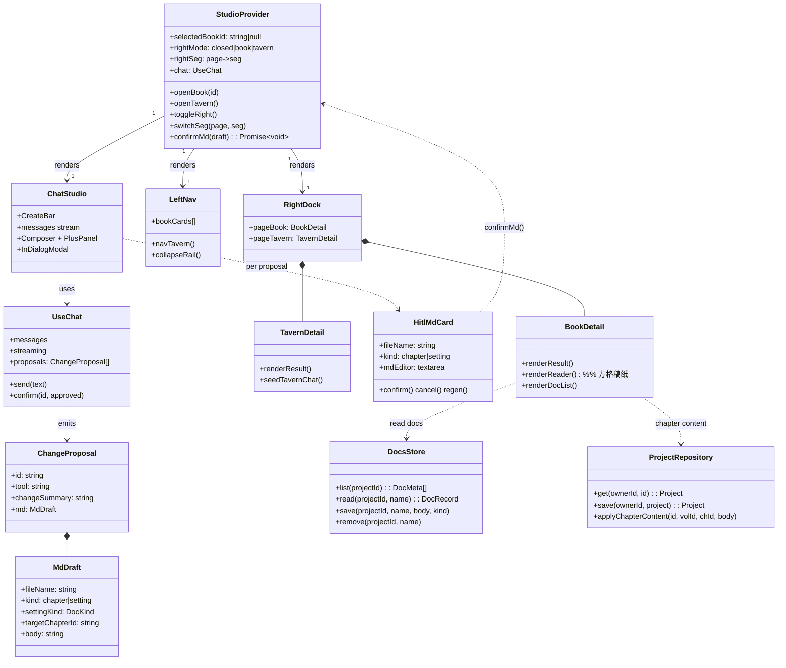
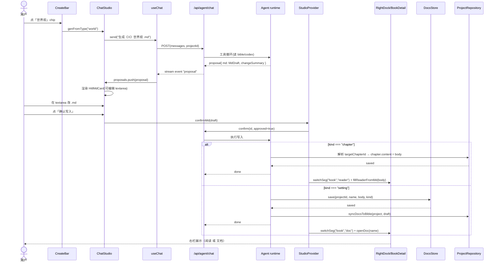

# Novel&Chat 新主界面重构 · 工程落地方案

> **评审角色**：架构师（Bob / 高见远）
> **评审对象**：`NovelChat_UI_REDESIGN_SPEC.md` §9（v5.2 终态）+ `NovelChat_main_prototype.html`（可交互原型）
> **落点**：Electron + Next.js 15 App Router + React 19 + TS strict + Tailwind v4 + CSS 变量设计系统
> **范围**：仅架构设计 + 任务分解，**不写实现代码**
> **权威依据**：新主界面外壳语义以 §9 为准；令牌以 §9.1 清爽风层为准；原型 `:root` 为取值来源；旧 §4.2/§8 仅作历史参考。

---

## 1. 实现方案 + 框架选型

### 1.1 新三栏外壳如何落地（新建 vs 改造）

**结论：改造现有 `AppShell.tsx` 为「持久化工作室外壳」，但把"新主界面"收敛为一个单一主屏。**

- **外壳形态**：`AppShell.tsx` 重写为 `StudioShell`——`topbar 52px` + 横向三栏（`left 248/56` + `center flex:1` + `right 380/0`）。左/右收起逻辑沿用现有 pointer 拖拽骨架（保留无第三方依赖的做法），但收起语义改为"中栏 `flex:1` 自动吃满"（修掉旧版留白问题，见 §9.2）。
- **外壳不再渲染 `children` 旧路由树**：新主界面把"导航/对话/展示"全收进一个主屏。推荐把**新主界面作为应用根 `/`**（取代旧 `app/page.tsx` 书房 hub），`layout.tsx` 的 `AppShell` 改为渲染 `StudioShell`，由 `app/page.tsx` 挂载 `StudioProvider` 并提供中栏 `ChatStudio`。
- **`/project/[id]` 工作台是否保留为独立路由**：**不再作为默认工作区**。"book 选中"改为应用内状态（点左栏书即 `selectedBookId` + 右栏 `#page-book`），不再跳路由。保留 `/project/[id]` 仅作**深链兼容**：重定向到 `/?book=<id>`，由 Studio 打开该书详情。
- **辅助路由处置**：`/style`、`/settings`、`/shelf`、`/new`、`/continue`、`/agent` 保留为可达深链，但主路径改为"在对话内触达"——`新/续写/拆书工坊` 经中栏「+」展开器 `seedChat` 进对话；`接口设置/技能` 经对话内模态。旧独立页降级为可选项（不删除，避免断书签，见 §8 待明确）。

### 1.2 令牌迁移策略（暖阁 → 清爽风）

**结论：新增"清爽风令牌层"作为主界面权威层；暖阁令牌降级为"继承面"，不整体删除。**

- `app/globals.css` 的 `:root` 采用**双层共存**：
  1. **清爽风主层（新主界面权威）**：直接采用原型 `:root` 取值——`--bg #f6f7f9` / `--surface #fff` / `--surface-2 #f1f3f5` / `--surface-3 #e9edf0` / `--border rgba(27,31,36,.10)` / `--border-strong rgba(27,31,36,.16)` / `--fg #1f2328` / `--fg-dim #656d76` / `--fg-faint #8b949e` / `--accent #d97757` / `--accent-strong #b85c3c` / `--accent-soft rgba(217,119,87,.12)` / `--jade #3f9d6b` / `--amber #d9a23c` / `--danger #e5484d` / `--paper #fbfaf6` / `--paper-line rgba(27,31,36,.06)` / 圆角 `--radius 10px`/`--radius-sm 8px`/`--radius-pill 999px` / 阴影 `--shadow-sm`/`--shadow-md`。
  2. **暖阁降级层（仅继承面）**：保留 `--ink*`/`--cinnabar*`/`--jade(旧)` 等用于**方格稿纸底色 `--paper`（暖白）、汉字印章 `.seal`、以及暗色三件套救火目标**。
- **方格稿纸暖白保留**：`--paper #fbfaf6`（已由清爽层定义）+ 衬线 `--font-serif` 不变，右栏阅读器继续用暖白方格，与清爽壳形成"书卷焦点"对比（§9.1 设计意图）。
- **令牌映射表（暖阁 → 清爽风，主壳替换）**：

  | 语义 | 旧暖阁变量 | 新清爽变量 | 取值 |
  |---|---|---|---|
  | 主强调 | `--cinnabar #c2673f` | `--accent #d97757` | 克制珊瑚 |
  | 完成/玉 | `--jade #6f9068` | `--jade #3f9d6b` | 清新绿 |
  | 草稿/进行中/金 | `--gold #d3a24c` | `--amber #d9a23c` | 琥珀 |
  | 错误红 | `#b23b2e`(散落) | `--danger #e5484d` | 砖红 |
  | 画布底 | `--ink #f4ead6` | `--bg #f6f7f9` | 近白 |
  | 面板 | `--ink-800 #fffdf8` | `--surface #fff` | 白 |
  | 表面二级 | `--ink-700 #f1e5cf` | `--surface-2 #f1f3f5` | 浅灰 |
  | 边框 | `--line rgba(74,54,38,.10)` | `--border rgba(27,31,36,.10)` | 中性 |
  | 前景字 | `--fg #3b2f26` | `--fg #1f2328` | 近黑 |
  | 稿纸底 | `--paper #fbf5e8` | `--paper #fbfaf6` | 暖白（保留记忆点） |

- **缺口清理（§3.1/§10 P2）**：新增 `--space-1..16` 间距阶梯、`--shadow-float`、层级 `--z-*`；正式定义 `--accent`（指向主色）、`--ink-900`（深底反白）；清除 `--ink-900`/`--accent` 未定义引用（`AgentPanel.tsx` 里用到）。全站检索替换硬编码色与 Tailwind 暗色类。

### 1.3 中栏对话系统（基于现有 `useChat` + `AgentChat`）

**结论：复用 `lib/agent/useChat` 状态机与 `/api/agent/chat` NDJSON 流；新建 `ChatStudio` 承载"快速创作栏 + 消息流 + composer + 展开器 + 对话内模态"，把 `AgentChat` 的视觉/提案逻辑吸收进工作室上下文。**

- `useChat` 已具备 `send/runSkill/confirm/stop/reset` + `proposals` 流式聚合，**直接复用**，不重写运行时。
- **升级点（见 §1.5 / T06）**：`ChangeProposal` 增加可选 `md?: MdDraft`；`useChat` 增加"md 提案"渲染分支与 `confirmMd` 应用入口；`AgentChat` 的 `ProposalCard` 升级为 `HitlMdCard`（可编辑 `.md` 文本框）。
- 快速创作栏 `CreateBar`：4 个 chip（世界观/人物设定/大纲/章节）→ 调 `chat.send("生成《X》的【世界观】.md 草稿")` 或直接触发一个 `quickGen(type)` 短路（不走完整工具循环也可，由 runtime 决定）。
- composer 圆形「+」展开器 `PlusPanel`：5 能力（开新书/续写/拆书工坊 → `seedChat` 进对话；接口设置/技能 → 对话内模态 `InDialogModal`）。顶栏「新对话」→ `chat.reset()`。

### 1.4 右栏双详情页（互斥、三分段）

**结论：`RightDock` 内部渲染两个**完全独立**的 `detail-page`（`#page-book` / `#page-tavern`），靠 `rightMode` 切换 CSS class 互斥显示，数据/DOM/渲染函数三处都不交叉（对齐 §9.5）。**

- `#page-book`（点左栏某书触发）：`BookDetail` = 独立表头（书名 + 三分段 `[成果|阅读|文档]` + 收起 chevron）+ 内容区。
  - 成果：logline / 梗概 / 章节列表(状态点) / 核心设定(meta-tags)，数据来自 `Project`。
  - 阅读：方格稿纸 `Reader`（卷·章头 + 衬线正文），确认写入章节后 `fillReaderFromMd()` 落稿。
  - 文档：`.md` 列表 `DocList` + Markdown 渲染 `DocReader`。
- `#page-tavern`（点左栏「酒馆AI」触发）：`TavernDetail` = 同类结构，数据来自 `docsStoreTv`/灵感碎片。两者**永不同时存在**（互斥 class）。
- 收起：chevron → `toggleRight()` 加 `collapsed`(`width:0`)，右缘 `.right-rail` 浮动手柄 tab 重开（酒馆AI / 书架两按钮）。

### 1.5 JSON → .md 事实源迁移策略

**结论：采用"共存 + .md 为主"策略（推荐），非硬迁移。**

- **`.md` 文件只承载"设定类产物"**（世界观/人物设定/大纲 + 灵感碎片），作为可编辑事实源，落 `data/projects/<id>/docs/<name>.md`。
- **章节正文不转 .md**：仍存 `Project.volumes[].chapters[].content`（JSON），右栏"阅读"只是把它渲染进方格稿纸（`Reader`）。这样避免百万字正文 IO 放大（呼应 P1-2 痛点），落稿即改 `chapter.content` 后 `ProjectRepository.save`。
- **bible JSON 处理**：`Project.bible`（结构化世界观/人物/大纲）保留为 Agent 程序化读取的缓存层（retrieval/assemblePersona 用），与 `.md` 双向同步：`confirmMd(setting)` 写入 `.md` 后，跑一次 `syncDocsToBible()` 把对应切片回填 `bible`；首次打开旧书时 `migrateBibleToDocs()` 一次性把 `bible` 拆成 `世界观.md`/`人物设定_*.md`/`大纲.md`（共存，旧 JSON 不删，作兜底）。
- **docsStore 存储模型**：见 §3。
- 是否"硬迁移"为待主理人确认项（见 §8），但本方案按"共存"设计，成本最低、风险最小。

### 1.6 暗色三件套救火目标对齐

**结论（建议）：随新壳统一为"清爽风令牌"，不再回暖阁。** 理由：新主壳已转清爽风（§9.1），若 TaskQueue/HistoryPanel/ExportDialog 回暖阁会产生"壳清爽、弹层暖阁"的新割裂；统一用 `--surface/--border/--accent/--jade/--amber/--danger` 才能彻底消除原 §7 痛点 1。方格稿纸 `--paper` 暖白是唯一的暖记忆点，保持不变。此为 §9.8 明确标注的待决项，最终以主理人拍板为准（见 §8）。

---

## 2. 文件列表及相对路径

> 标注：**新建 / 改造 / 废弃（降级）**。

### 2.1 新建文件

| 文件 | 职责 |
|---|---|
| `components/studio/StudioProvider.tsx` | 工作室共享状态 Context：selectedBookId / rightMode / rightSeg / chat 实例 / openBook / openTavern / toggleRight / switchSeg / confirmMd |
| `components/studio/StudioShell.tsx` | 新三栏外壳（topbar 52 + left + center + right），收起/拖拽逻辑 |
| `components/studio/LeftNav.tsx` | 左栏纯导航：酒馆AI 入口 + 书架 3 书 + 收起图标轨 |
| `components/studio/ChatStudio.tsx` | 中栏 AI 对话：create-bar + 消息流 + composer + plus 展开器 + 对话内模态 |
| `components/studio/CreateBar.tsx` | 顶部快速创作栏（4 chip） |
| `components/studio/Composer.tsx` | 输入框 + 圆形「+」+ 技能 chip + 发送/停止 |
| `components/studio/PlusPanel.tsx` | 「+」展开器 5 能力 |
| `components/studio/InDialogModal.tsx` | 对话内模态（接口设置 / 技能库） |
| `components/studio/HitlMdCard.tsx` | 可编辑 .md HITL 提案卡（升级自 AgentChat.ProposalCard） |
| `components/studio/RightDock.tsx` | 右栏容器：`#page-book` / `#page-tavern` 互斥 |
| `components/studio/BookDetail.tsx` | 书详情页：成果/阅读/文档 三分段 |
| `components/studio/TavernDetail.tsx` | 酒馆AI 详情页：成果/阅读/文档 + 进入闲聊 |
| `components/studio/Reader.tsx` | 方格稿纸阅读器（衬线 + 暖白格线） |
| `components/studio/DocList.tsx` | `.md` 文档列表 |
| `components/studio/DocReader.tsx` | Markdown 渲染阅读器（react-markdown） |
| `lib/docsStore.ts` | 设定类 .md 存储层（list/read/save/remove） |
| `lib/migrate.ts` | bible→docs 一次性迁移 + 同步接缝 syncDocsToBible |
| `lib/markdown.ts` | 轻量 md→html 渲染（react-markdown 的离线兜底） |
| `components/studio/Skeleton.tsx` | 骨架屏（状态规范 §7.2） |
| `components/studio/ErrorNote.tsx` | 统一错误条（用 `--danger`） |
| `components/studio/EmptyState.tsx` | 空状态组件 |
| `app/icon/NovelChat.tsx` 或 `public/logo.svg` | Novel&Chat 品牌标（离线可用） |

### 2.2 改造文件

| 文件 | 改造内容 |
|---|---|
| `app/globals.css` | `:root` 新增清爽风令牌层 + 间距/阴影/层级令牌；保留暖阁降级层；新增工作室类名（对齐原型） |
| `components/AppShell.tsx` | 重写为 StudioShell 形态（或改为薄包装，由 StudioShell 接管） |
| `app/layout.tsx` | metadata 品牌字 → Novel&Chat；保持 AppShell 包装 |
| `app/page.tsx` | 由"书房 hub"改为挂载 `StudioProvider` + `StudioShell`（新主界面根屏） |
| `app/project/[id]/page.tsx` | 改为深链兼容：读 `?book=` → 打开 Studio 该书；旧 Workspace 入口降级 |
| `components/AgentChat.tsx` | `ProposalCard` → 可编辑 `.md` 提案；视觉改清爽风；或直接被 ChatStudio 吸收 |
| `lib/agent/useChat.ts` | 扩展 md 提案事件解析 + `confirmMd(draft)` 写入入口 |
| `lib/agent/types.ts` | `ChangeProposal` 增加 `md?: MdDraft`；新增 `MdDraft`/`DocKind` 类型 |
| `lib/repository.ts` | `ProjectRepository` 增加 `applyChapterContent(id, volId, chId, body)` 接缝 |
| `components/LeftRail.tsx` | 改造为新 `LeftNav`（或废弃，由 studio/LeftNav 取代） |
| `components/TopBar.tsx` | 品牌字「暖阁」→「Novel&Chat」；52px；右「新对话」重置 |
| `components/TaskQueue.tsx` | 重画为清爽风 + 接入书详情"成果"/工作区入口（§9.8 救火） |
| `components/HistoryPanel.tsx` | 重画清爽风 + 接入章节级"版本历史"入口 |
| `components/ExportDialog.tsx` | 重画清爽风 + 接入导出入口 |
| `components/RoleplayChat.tsx` | 保留；改为经酒馆AI 页"进入"触发（见 §8 待明确） |

### 2.3 废弃 / 降级文件

| 文件 | 命运 | 说明 |
|---|---|---|
| `components/Workspace.tsx` | **降级为"专家模式"可选入口**（待确认） | 旧工作台容器；默认不再作为主工作区 |
| `components/StepOutline.tsx` | 降级 | 大纲专家编辑器，经书详情"成果→进入工作台(高级)"触达 |
| `components/StepWriting.tsx` | 降级 | 正文专家编辑器（含方格稿纸），同上 |
| `components/AgentPanel.tsx` | **废弃** | 旧"助手/角色对话"双 Tab 右栏被 RightDock 取代 |
| `components/step-outline/*` | 降级 | 随 StepOutline 降级 |
| `app/style/page.tsx`、`app/new/page.tsx`、`app/continue/page.tsx`、`app/shelf/page.tsx`、`app/settings/page.tsx`、`app/agent/page.tsx` | **保留为深链** | 主路径改为对话内模态/seedChat；独立页不删但降级 |

---

## 3. 数据结构和接口

### 3.1 `.md` 文档存储模型

- 目录：`data/projects/<id>/docs/<name>.md`
- 每个文件带 YAML front-matter 标识种类（列表时无需解析正文）：

```markdown
---
kind: world            # world | character | outline | inspiration | other
title: 世界观
---
# 世界观 · 长夜行
...
```

- 文件命名约定：`<种类>_<书名>.md` 或 `<章节名>.md`（章节类不走 docsStore，见下）；中文文件名，路径安全转义（`safeId` 同 storage.ts）。

### 3.2 `docsStore` 接口（设定类 .md 事实源）

```typescript
// lib/docsStore.ts
export type DocKind = "world" | "character" | "outline" | "inspiration" | "other";

export interface DocMeta {
  name: string;        // 世界观.md
  kind: DocKind;
  kindLabel: string;   // 世界观 / 人物 / 大纲 / 灵感
  words: number;
  updatedAt: number;
}
export interface DocRecord extends DocMeta { body: string; } // markdown 全文

export interface DocsStore {
  list(projectId: string): Promise<DocMeta[]>;
  read(projectId: string, name: string): Promise<DocRecord | null>;
  save(projectId: string, name: string, body: string, kind: DocKind): Promise<DocRecord>;
  remove(projectId: string, name: string): Promise<void>;
}
```

### 3.3 HITL 可编辑 .md 提案（契约扩展）

```typescript
// lib/agent/types.ts —— 在现有 ChangeProposal 上扩展（契约冻结，需主会话同步）
export interface MdDraft {
  fileName: string;            // 第3章_长夜微光.md
  kind: "chapter" | "setting"; // 章节类→右栏方格稿纸；设定类→右栏文档
  settingKind?: DocKind;        // kind==="setting" 时
  targetChapterId?: string;     // kind==="chapter" 时，定位 Project 章节
  body: string;                 // 可编辑 markdown 初始内容
}
export interface ChangeProposal {
  id: string;
  tool: string;
  args: unknown;
  changeSummary: string;
  diff?: unknown;
  md?: MdDraft;                 // ✅ 新增：可编辑 .md 提案
}
// 流式事件扩展（复用 proposal 事件，md 字段非空即视为 md 提案）
// AgentStreamEvent 增加分支：{ type: "proposal"; proposal: ChangeProposal }（proposal.md 可能非空）
```

### 3.4 reader 落稿数据流（确认写入）

- **章节类**（`kind==="chapter"`）：
  1. `confirmMd(draft)` → `useChat.confirm(id, true)` 回传 `ConfirmToken`。
  2. runtime 解析 `targetChapterId`（或由 `fileName` 经 `resolveChapter(title)` 匹配 `volumes[].chapters`）。
  3. `chapter.content = draft.body` → `projectRepository.save(ownerId, project)`（沿用 `ProjectRepository` 接缝，原子写）。
  4. 客户端 `switchSeg("book","reader")` + `fillReaderFromMd(body)` 右栏方格稿纸落稿。
- **设定类**（`kind==="setting"`）：
  1. runtime `docsStore.save(projectId, name, body, settingKind)`。
  2. 同步 `syncDocsToBible(project, draft)` 回填 `bible` 对应切片。
  3. 客户端 `switchSeg("book","doc")` + `openDoc(name)` 右栏文档重开渲染。

### 3.5 类图（Mermaid）



---

## 4. 程序调用流程（Mermaid）

### 4.1 快速创作 → AI 生成 .md 提案卡 → 确认写入 → 右栏落稿



### 4.2 点书架 → 右栏书详情 → 切阅读/文档

```mermaid
sequenceDiagram
    actor U as 用户
    participant LN as LeftNav
    participant SP as StudioProvider
    participant RD as RightDock
    participant BD as BookDetail
    participant PR as ProjectRepository
    participant DS as DocsStore

    U->>LN: 点书架某书 card
    LN->>SP: openBook(id)
    SP->>SP: selectedBookId=id; rightMode="book"
    SP->>RD: 显示 #page-book
    SP->>BD: renderBookResult(project)
    BD->>PR: 读取 project(梗概/章节/标签)
    PR-->>BD: 成果数据
    BD-->>U: 展示「成果」pane
    U->>BD: 切「阅读」
    BD->>SP: switchSeg("book","reader")
    SP->>BD: 显示 Reader(方格稿纸)
    U->>BD: 切「文档」
    BD->>SP: switchSeg("book","doc")
    BD->>DS: list(projectId)
    DS-->>BD: DocMeta[]
    BD-->>U: 文档列表
    U->>BD: 点某 .md
    BD->>DS: read(projectId, name)
    DS-->>BD: DocRecord.body
    BD-->>U: Markdown 渲染阅读器
    U->>RD: 收起 chevron
    RD->>SP: toggleRight() → rightMode="closed"
```

---

## 5. 任务列表（有序 · 含依赖 · 按实现顺序）

> 标识：**地基必做** = 无此后续无法开工；**可延后** = 可在首版后补；**并行** = 与相邻任务无强耦合可同期进行。
> 总预估 ≈ **36 人天**（详见各任务；含联调缓冲）。

| 编号 | 标题 | 归属文件 | 依赖前置 | 工作量 | 属性 |
|---|---|---|---|---|---|
| **T01** | 令牌地基：清爽风层 + 暖阁降级 + 映射 + 清硬编码/undefined | `app/globals.css`、`components/*`（检索替换） | 无 | 3d | 地基必做 |
| **T02** | 令牌组件层：间距/阴影/层级令牌 + 通用语义类升级 | `app/globals.css` | T01 | 1.5d | 地基必做 |
| **T03** | 新三栏外壳骨架：StudioShell + AppShell 重写 + 路由切换（根 `/` = 工作室） | `components/studio/StudioShell.tsx`、`AppShell.tsx`、`app/layout.tsx`、`app/page.tsx`、`app/project/[id]/page.tsx` | T01,T02 | 3d | 地基必做 |
| **T04** | 左栏纯导航：LeftNav + 书架 + 收起图标轨 + StudioProvider(选书状态) | `components/studio/LeftNav.tsx`、`StudioProvider.tsx` | T03 | 2d | 必做 |
| **T05** | 中栏 AI 对话：ChatStudio（create-bar + 消息流 + composer + plus + 模态），复用 useChat | `components/studio/ChatStudio.tsx` 等 | T03,T04 | 4d | 必做 |
| **T06** | HITL 可编辑 .md 提案卡升级（契约扩展 + HitlMdCard + useChat md 分支） | `lib/agent/types.ts`、`useChat.ts`、`components/studio/HitlMdCard.tsx`、`AgentChat.tsx` | T05 | 3d | 必做 |
| **T07** | .md 文档存储层 docsStore（list/read/save/remove + front-matter） | `lib/docsStore.ts`、`lib/storage.ts`(扩展目录) | 无（与 T01 并行） | 2d | 并行可先做 |
| **T08** | 右栏双详情页：RightDock + BookDetail + TavernDetail + Reader + DocList/DocReader | `components/studio/RightDock.tsx` 等 | T04,T06,T07 | 4d | 必做 |
| **T09** | 确认写入闭环：reader 落稿 + doc 重开 + 收起让位 + ProjectRepository.applyChapterContent | `StudioProvider.tsx`、`lib/repository.ts`、`components/studio/*` | T06,T07,T08 | 2.5d | 必做 |
| **T10** | JSON→.md 共存迁移：migrateBibleToDocs + syncDocsToBible + 旧 21 JSON 处理 | `lib/migrate.ts`、`lib/repository.ts` | T07,T09 | 2d | 必做（推荐共存） |
| **T11** | 暗色三件套救火对齐清爽风 + 补挂载（TaskQueue/HistoryPanel/ExportDialog） | 三个组件 + `Workspace`/`BookDetail` 挂载点 | T01,T03 | 2.5d | 必做（§9.8） |
| **T12** | 状态规范组件：Skeleton / ErrorNote / EmptyState / 保存态 / HITL 统一 | `components/studio/*` + `globals.css` | T02 | 1.5d | 并行（§10 P5） |
| **T13** | 图标接入：lucide-react + 印章集 + 双轨搭配（替换 Unicode） | `public/`、`components/*` | T03 | 2d | 并行（§10 P6） |
| **T14** | 角色对话 + 旧工作台专家模式落点（依 §8 决策） | `RoleplayChat.tsx`、`Workspace.tsx`、`TavernDetail.tsx` | T04,T05 | 2d | 可延后 |
| **T15** | 预留深色令牌结构 `[data-theme=dark]`（不接 UI） | `app/globals.css` | T01 | 0.5d | 可延后（§10 P7） |

**可并行组**：`T07` ∥ `T01`；`T11` ∥ `T12` ∥ `T13`（三者都只依赖令牌/外壳地基，可同期）；`T14`/`T15` 可后置。
**必须串行链**：`T01→T02→T03→T04→T05→T06→T08→T09→T10`；`T07` 汇入 `T08/T09`。

---

## 6. 依赖包列表

| 包 | 用途 | 是否新增 |
|---|---|---|
| `next@15` / `react@19` / `typescript` / `tailwindcss@4` | 既有技术栈（不换） | 已有 |
| `lucide-react` | 线性 SVG 图标（§6.2 双轨制操作类） | ✅ 新增 |
| `react-markdown` + `remark-gfm` | `.md` 文档阅读器渲染（默认不渲染原始 HTML，安全） | ✅ 新增（推荐） |
| `lib/markdown.ts`（自研轻量渲染） | react-markdown 离线/体积兜底（heading/list/blockquote/code/strong/em） | 新增（自研，零依赖） |
| `vitest` + `@testing-library/react` | 契约/存储层单测（P1-3 已补，沿用） | 已有 |

> 说明：markdown 渲染优先 `react-markdown`+`remark-gfm`（保真 + 安全）；若担忧桌面端体积，可用 `lib/markdown.ts` 自研渲染（原型 `mdToHtml` 已验证够用）。两者二选一或并存（doc-reader 用前者，toast/轻量处用后者）。

---

## 7. 共享知识（跨文件约定）

- **令牌迁移映射表**（见 §1.2 表格）：主壳一律 `--accent/--jade/--amber/--danger/--bg/--surface/--border/--fg`；方格稿纸与印章继续用暖阁 `--paper/--cinnabar`。全站禁硬编码色与 Tailwind 暗色类。
- **类名规范（对齐原型）**：新壳类名直接复用原型词汇——`.app/.topbar/.left/.center/.right/.left.collapsed/.right.collapsed/.nav-item/.book-card/.dot.write|.skeleton|.brew/.create-bar/.create-chip/.chat/.msg.user|.msg.ai/.bubble/.tool-row/.chip-act/.hitl/.hitl-head/.md-editor/.btn-primary/.btn-ghost/.composer/.plus-panel/.plus-btn/.modal-overlay/.detail-page/#page-book/#page-tavern/.detail-head/.seg/.pane-r/.reader/.doc-list/.doc-card/.doc-reader/.right-rail`。旧 `.appshell*/.rail*/.agentpanel*` 随 AppShell 重写弃用。
- **`.md` 文件命名约定**：`<种类>_<书名>.md`（如 `世界观.md`、`人物设定_沈寄.md`、`大纲_卷一.md`）；章节类不走 docsStore，直接写 `Project.chapters[].content`；front-matter `kind` 必填。
- **状态语义强制**：`jade=完成` / `amber=草稿·进行中` / `accent=主操作` / `danger=错误`；状态点 `.dot.write=jade/.skeleton=amber/.brew=faint`。
- **HITL 幂等**：`confirmMd` 必须带 `ConfirmToken.proposalId` 回传，runtime 同轮 apply 一次；编辑后的 `body` 以提案卡内 textarea 值为准。
- **保存态**：工作台 900ms 防抖保留（专家模式）；对话流无自动保存，提案确认即落盘。
- **窗口约束**：1280×860 基准，最小 960×640；<900px 隐藏左右栏，中栏独占。
- **品牌字**：全站 `Novel&Chat`（替换「墨章」「暖阁」），含 `electron/main.js` 窗口标题、`app/layout.tsx` metadata、`TopBar`。

---

## 8. 待明确事项（需主理人决策）

1. **暗色三件套救火方向**（§9.8 明确待决）：本方案建议统一为**清爽风令牌**（与 §1.6 一致）。是否同意？还是坚持回暖阁？
2. **JSON→.md 硬迁移 vs 共存**：本方案推荐**共存（.md 为主，bible JSON 作缓存兜底）**。是否接受？或要求硬迁移（删 bible JSON）？
3. **旧工作台（Workspace/StepOutline/StepWriting）命运**：建议**保留为"专家模式"入口**（经书详情"成果→进入工作台(高级)"触达），默认不显示，避免功能价值丢失。还是完全融入对话 / 直接废弃？
4. **角色对话落点**：右栏"助手/角色对话"双 Tab 已删。建议**角色对话迁入「酒馆AI」页**——选角后"进入"把中栏切到 roleplay 模式（复用 `/api/agent/roleplay` + `useRoleplay`）。是否同意此落点？
5. **辅助独立页（/new /continue /style /shelf /settings /agent）**：建议保留为深链、主路径走对话内模态/seedChat。是否保留独立页，还是进一步折叠？
6. **字体离线**：清爽风用 `--font-ui` 系统字体 + Noto Serif SC（稿纸）。是否将 Noto 字体打包进 Electron 离线（原仅 Google Fonts 在线）？
7. **md 渲染器选型**：`react-markdown`+`remark-gfm`（推荐）vs 自研 `lib/markdown.ts`（零依赖）？
8. **TargetChapter 解析**：章节类提案确认时，用 `targetChapterId` 显式携带，还是由 `fileName`/标题模糊匹配 `volumes[].chapters`？建议 Agent 显式产出 `targetChapterId` 以确保百万字下精准落稿。

---

## 9. 评审结论速览

- **方案可行性**：高。现有 `useChat`/`AgentChat`/Agent runtime/HITL 幂等机制完整可复用，新主界面主要是"外壳重组 + 提案卡升级 + 新增 .md 存储层 + 右栏双详情页"，无颠覆性重写。
- **最大风险点**：① 令牌双层共存的命名冲突（`--jade` 新旧值不同，需全局只引用清爽层）；② 章节落稿的 targetChapter 精准定位；③ JSON→.md 共存期的双向同步正确性（建议用单测覆盖 `lib/migrate.ts`/`docsStore.ts`）。
- **首版最小可交付（MVP）**：T01→T09（令牌 + 外壳 + 对话 + HITL .md + 右栏 + 闭环），约 **27 人天**，即可跑通"快速创作→确认写入→右栏落稿"主闭环。T10–T15 为增强/救火/预留，可分期。
